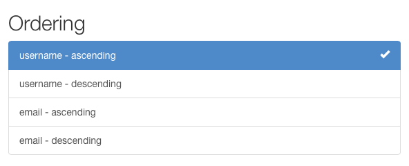

---
source:
    - filters.py
---

# Filtering

> The root QuerySet provided by the Manager describes all objects in the database table.  Usually, though, you'll need to select only a subset of the complete set of objects.
>
> &mdash; [Django documentation][cite]

The default behavior of REST framework's generic list views is to return the entire queryset for a model manager.  Often you will want your API to restrict the items that are returned by the queryset.

The simplest way to filter the queryset of any view that subclasses `GenericAPIView` is to override the `.get_queryset()` method.

Overriding this method allows you to customize the queryset returned by the view in a number of different ways.

## Filtering against the current user

You might want to filter the queryset to ensure that only results relevant to the currently authenticated user making the request are returned.

You can do so by filtering based on the value of `request.user`.

For example:

    from myapp.models import Purchase
    from myapp.serializers import PurchaseSerializer
    from rest_framework import generics

    class PurchaseList(generics.ListAPIView):
        serializer_class = PurchaseSerializer

        def get_queryset(self):
            """
            This view should return a list of all the purchases
            for the currently authenticated user.
            """
            user = self.request.user
            return Purchase.objects.filter(purchaser=user)

## Filtering against the URL

Another style of filtering might involve restricting the queryset based on some part of the URL.

For example if your URL config contained an entry like this:

    re_path('^purchases/(?P<username>.+)/$', PurchaseList.as_view()),

You could then write a view that returned a purchase queryset filtered by the username portion of the URL:

    class PurchaseList(generics.ListAPIView):
        serializer_class = PurchaseSerializer

        def get_queryset(self):
            """
            This view should return a list of all the purchases for
            the user as determined by the username portion of the URL.
            """
            username = self.kwargs['username']
            return Purchase.objects.filter(purchaser__username=username)

## Filtering against query parameters

A final example of filtering the initial queryset would be to determine the initial queryset based on query parameters in the url.

We can override `.get_queryset()` to deal with URLs such as `http://example.com/api/purchases?username=denvercoder9`, and filter the queryset only if the `username` parameter is included in the URL:

    class PurchaseList(generics.ListAPIView):
        serializer_class = PurchaseSerializer

        def get_queryset(self):
            """
            Optionally restricts the returned purchases to a given user,
            by filtering against a `username` query parameter in the URL.
            """
            queryset = Purchase.objects.all()
            username = self.request.query_params.get('username', None)
            if username is not None:
                queryset = queryset.filter(purchaser__username=username)
            return queryset

---

# Generic Filtering

As well as being able to override the default queryset, REST framework also includes support for generic filtering backends that allow you to easily construct complex searches and filters.

Generic filters can also present themselves as HTML controls in the browsable API and admin API.

## Setting filter backends

The default filter backends may be set globally, using the `DEFAULT_FILTER_BACKENDS` setting. For example.

    REST_FRAMEWORK = {
        'DEFAULT_FILTER_BACKENDS': ['django_filters.rest_framework.DjangoFilterBackend']
    }

You can also set the filter backends on a per-view, or per-viewset basis,
using the `GenericAPIView` class-based views.

    import django_filters.rest_framework
    from django.contrib.auth.models import User
    from myapp.serializers import UserSerializer
    from rest_framework import generics

    class UserListView(generics.ListAPIView):
        queryset = User.objects.all()
        serializer_class = UserSerializer
        filter_backends = [django_filters.rest_framework.DjangoFilterBackend]

## Filtering and object lookups

Note that if a filter backend is configured for a view, then as well as being used to filter list views, it will also be used to filter the querysets used for returning a single object.

For instance, given the previous example, and a product with an id of `4675`, the following URL would either return the corresponding object, or return a 404 response, depending on if the filtering conditions were met by the given product instance:

    http://example.com/api/products/4675/?category=clothing&max_price=10.00

## Overriding the initial queryset

Note that you can use both an overridden `.get_queryset()` and generic filtering together, and everything will work as expected.  For example, if `Product` had a many-to-many relationship with `User`, named `purchase`, you might want to write a view like this:

    class PurchasedProductsList(generics.ListAPIView):
        """
        Return a list of all the products that the authenticated
        user has ever purchased, with optional filtering.
        """
        model = Product
        serializer_class = ProductSerializer
        filterset_class = ProductFilter

        def get_queryset(self):
            user = self.request.user
            return user.purchase_set.all()

---

# API Guide

## DjangoFilterBackend

The [`django-filter`][django-filter-docs] library includes a `DjangoFilterBackend` class which
supports highly customizable field filtering for REST framework.

To use `DjangoFilterBackend`, first install `django-filter`.

    pip install django-filter

Then add `'django_filters'` to Django's `INSTALLED_APPS`:

    INSTALLED_APPS = [
        ...
        'django_filters',
        ...
    ]

You should now either add the filter backend to your settings:

    REST_FRAMEWORK = {
        'DEFAULT_FILTER_BACKENDS': ['django_filters.rest_framework.DjangoFilterBackend']
    }

Or add the filter backend to an individual View or ViewSet.

    from django_filters.rest_framework import DjangoFilterBackend

    class UserListView(generics.ListAPIView):
        ...
        filter_backends = [DjangoFilterBackend]

If all you need is simple equality-based filtering, you can set a `filterset_fields` attribute on the view, or viewset, listing the set of fields you wish to filter against.

    class ProductList(generics.ListAPIView):
        queryset = Product.objects.all()
        serializer_class = ProductSerializer
        filter_backends = [DjangoFilterBackend]
        filterset_fields = ['category', 'in_stock']

This will automatically create a `FilterSet` class for the given fields, and will allow you to make requests such as:

    http://example.com/api/products?category=clothing&in_stock=True

For more advanced filtering requirements you can specify a `FilterSet` class that should be used by the view.
You can read more about `FilterSet`s in the [django-filter documentation][django-filter-docs].
It's also recommended that you read the section on [DRF integration][django-filter-drf-docs].

## SearchFilter

The `SearchFilter` class supports simple single query parameter based searching, and is based on the [Django admin's search functionality][search-django-admin].

When in use, the browsable API will include a `SearchFilter` control:

The `SearchFilter` class will only be applied if the view has a `search_fields` attribute set.  The `search_fields` attribute should be a list of names of text type fields on the model, such as `CharField` or `TextField`.

    from rest_framework import filters

    class UserListView(generics.ListAPIView):
        queryset = User.objects.all()
        serializer_class = UserSerializer
        filter_backends = [filters.SearchFilter]
        search_fields = ['username', 'email']

This will allow the client to filter the items in the list by making queries such as:

    http://example.com/api/users?search=russell

You can also perform a related lookup on a ForeignKey or ManyToManyField with the lookup API double-underscore notation:

    search_fields = ['username', 'email', 'profile__profession']
    
For [JSONField][JSONField] and [HStoreField][HStoreField] fields you can filter based on nested values within the data structure using the same double-underscore notation:

    search_fields = ['data__breed', 'data__owner__other_pets__0__name']

By default, searches will use case-insensitive partial matches.  The search parameter may contain multiple search terms, which should be whitespace and/or comma separated.  If multiple search terms are used then objects will be returned in the list only if all the provided terms are matched.

The search behavior may be restricted by prepending various characters to the `search_fields`.

* '^' Starts-with search.
* '=' Exact matches.
* '@' Full-text search.  (Currently only supported Django's [PostgreSQL backend](https://docs.djangoproject.com/en/dev/ref/contrib/postgres/search/).)
* '$' Regex search.

For example:

    search_fields = ['=username', '=email']

By default, the search parameter is named `'search'`, but this may be overridden with the `SEARCH_PARAM` setting.

To dynamically change search fields based on request content, it's possible to subclass the `SearchFilter` and override the `get_search_fields()` function. For example, the following subclass will only search on `title` if the query parameter `title_only` is in the request:

    from rest_framework import filters

    class CustomSearchFilter(filters.SearchFilter):
        def get_search_fields(self, view, request):
            if request.query_params.get('title_only'):
                return ['title']
            return super(CustomSearchFilter, self).get_search_fields(view, request)

For more details, see the [Django documentation][search-django-admin].

---

## OrderingFilter

The `OrderingFilter` class supports simple query parameter controlled ordering of results.

By default, the query parameter is named `'ordering'`, but this may by overridden with the `ORDERING_PARAM` setting.

For example, to order users by username:

    http://example.com/api/users?ordering=username

The client may also specify reverse orderings by prefixing the field name with '-', like so:

    http://example.com/api/users?ordering=-username

Multiple orderings may also be specified:

    http://example.com/api/users?ordering=account,username

### Specifying which fields may be ordered against

It's recommended that you explicitly specify which fields the API should allowing in the ordering filter.  You can do this by setting an `ordering_fields` attribute on the view, like so:

    class UserListView(generics.ListAPIView):
        queryset = User.objects.all()
        serializer_class = UserSerializer
        filter_backends = [filters.OrderingFilter]
        ordering_fields = ['username', 'email']

This helps prevent unexpected data leakage, such as allowing users to order against a password hash field or other sensitive data.

If you *don't* specify an `ordering_fields` attribute on the view, the filter class will default to allowing the user to filter on any readable fields on the serializer specified by the `serializer_class` attribute.

If you are confident that the queryset being used by the view doesn't contain any sensitive data, you can also explicitly specify that a view should allow ordering on *any* model field or queryset aggregate, by using the special value `'__all__'`.

    class BookingsListView(generics.ListAPIView):
        queryset = Booking.objects.all()
        serializer_class = BookingSerializer
        filter_backends = [filters.OrderingFilter]
        ordering_fields = '__all__'

### Specifying a default ordering

If an `ordering` attribute is set on the view, this will be used as the default ordering.

Typically you'd instead control this by setting `order_by` on the initial queryset, but using the `ordering` parameter on the view allows you to specify the ordering in a way that it can then be passed automatically as context to a rendered template.  This makes it possible to automatically render column headers differently if they are being used to order the results.

    class UserListView(generics.ListAPIView):
        queryset = User.objects.all()
        serializer_class = UserSerializer
        filter_backends = [filters.OrderingFilter]
        ordering_fields = ['username', 'email']
        ordering = ['username']

The `ordering` attribute may be either a string or a list/tuple of strings.

---

# Custom generic filtering

You can also provide your own generic filtering backend, or write an installable app for other developers to use.

To do so override `BaseFilterBackend`, and override the `.filter_queryset(self, request, queryset, view)` method.  The method should return a new, filtered queryset.

As well as allowing clients to perform searches and filtering, generic filter backends can be useful for restricting which objects should be visible to any given request or user.

## Example

For example, you might need to restrict users to only being able to see objects they created.

    class IsOwnerFilterBackend(filters.BaseFilterBackend):
        """
        Filter that only allows users to see their own objects.
        """
        def filter_queryset(self, request, queryset, view):
            return queryset.filter(owner=request.user)

We could achieve the same behavior by overriding `get_queryset()` on the views, but using a filter backend allows you to more easily add this restriction to multiple views, or to apply it across the entire API.

## Customizing the interface

Generic filters may also present an interface in the browsable API. To do so you should implement a `to_html()` method which returns a rendered HTML representation of the filter. This method should have the following signature:

`to_html(self, request, queryset, view)`

The method should return a rendered HTML string.

## Pagination & schemas

You can also make the filter controls available to the schema autogeneration
that REST framework provides, by implementing a `get_schema_fields()` method. This method should have the following signature:

`get_schema_fields(self, view)`

The method should return a list of `coreapi.Field` instances.

# Third party packages

The following third party packages provide additional filter implementations.

## Django REST framework filters package

The [django-rest-framework-filters package][django-rest-framework-filters] works together with the `DjangoFilterBackend` class, and allows you to easily create filters across relationships, or create multiple filter lookup types for a given field.

## Django REST framework full word search filter

The [djangorestframework-word-filter][django-rest-framework-word-search-filter] developed as alternative to `filters.SearchFilter` which will search full word in text, or exact match.

## Django URL Filter

[django-url-filter][django-url-filter] provides a safe way to filter data via human-friendly URLs. It works very similar to DRF serializers and fields in a sense that they can be nested except they are called filtersets and filters. That provides easy way to filter related data. Also this library is generic-purpose so it can be used to filter other sources of data and not only Django `QuerySet`s.

## drf-url-filters

[drf-url-filter][drf-url-filter] is a simple Django app to apply filters on drf `ModelViewSet`'s `Queryset` in a clean, simple and configurable way. It also supports validations on incoming query params and their values. A beautiful python package `Voluptuous` is being used for validations on the incoming query parameters. The best part about voluptuous is you can define your own validations as per your query params requirements.

[cite]: https://docs.djangoproject.com/en/stable/topics/db/queries/#retrieving-specific-objects-with-filters
[django-filter-docs]: https://django-filter.readthedocs.io/en/latest/index.html
[django-filter-drf-docs]: https://django-filter.readthedocs.io/en/latest/guide/rest_framework.html
[search-django-admin]: https://docs.djangoproject.com/en/stable/ref/contrib/admin/#django.contrib.admin.ModelAdmin.search_fields
[django-rest-framework-filters]: https://github.com/philipn/django-rest-framework-filters
[django-rest-framework-word-search-filter]: https://github.com/trollknurr/django-rest-framework-word-search-filter
[django-url-filter]: https://github.com/miki725/django-url-filter
[drf-url-filter]: https://github.com/manjitkumar/drf-url-filters
[HStoreField]: https://docs.djangoproject.com/en/3.0/ref/contrib/postgres/fields/#hstorefield
[JSONField]: https://docs.djangoproject.com/en/3.0/ref/contrib/postgres/fields/#jsonfield
