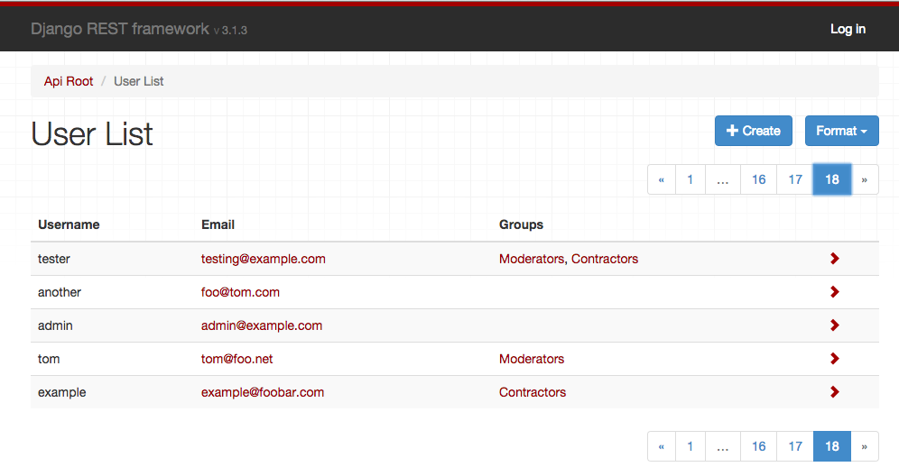

---
source:
    - renderers.py
---

# Renderers

> Before a TemplateResponse instance can be returned to the client, it must be rendered. The rendering process takes the intermediate representation of template and context, and turns it into the final byte stream that can be served to the client.
>
> &mdash; [Django documentation][cite]

REST framework includes a number of built in Renderer classes, that allow you to return responses with various media types.  There is also support for defining your own custom renderers, which gives you the flexibility to design your own media types.

## How the renderer is determined

The set of valid renderers for a view is always defined as a list of classes.  When a view is entered REST framework will perform content negotiation on the incoming request, and determine the most appropriate renderer to satisfy the request.

The basic process of content negotiation involves examining the request's `Accept` header, to determine which media types it expects in the response.  Optionally, format suffixes on the URL may be used to explicitly request a particular representation.  For example the URL `http://example.com/api/users_count.json` might be an endpoint that always returns JSON data.

For more information see the documentation on [content negotiation][conneg].

## Setting the renderers

The default set of renderers may be set globally, using the `DEFAULT_RENDERER_CLASSES` setting.  For example, the following settings would use `JSON` as the main media type and also include the self describing API.

    REST_FRAMEWORK = {
        'DEFAULT_RENDERER_CLASSES': [
            'rest_framework.renderers.JSONRenderer',
            'rest_framework.renderers.BrowsableAPIRenderer',
        ]
    }

You can also set the renderers used for an individual view, or viewset,
using the `APIView` class-based views.

    from django.contrib.auth.models import User
    from rest_framework.renderers import JSONRenderer
    from rest_framework.response import Response
    from rest_framework.views import APIView

    class UserCountView(APIView):
        """
        A view that returns the count of active users in JSON.
        """
        renderer_classes = [JSONRenderer]

        def get(self, request, format=None):
            user_count = User.objects.filter(active=True).count()
            content = {'user_count': user_count}
            return Response(content)

Or, if you're using the `@api_view` decorator with function based views.

    @api_view(['GET'])
    @renderer_classes([JSONRenderer])
    def user_count_view(request, format=None):
        """
        A view that returns the count of active users in JSON.
        """
        user_count = User.objects.filter(active=True).count()
        content = {'user_count': user_count}
        return Response(content)

## Ordering of renderer classes

It's important when specifying the renderer classes for your API to think about what priority you want to assign to each media type.  If a client underspecifies the representations it can accept, such as sending an `Accept: */*` header, or not including an `Accept` header at all, then REST framework will select the first renderer in the list to use for the response.

For example if your API serves JSON responses and the HTML browsable API, you might want to make `JSONRenderer` your default renderer, in order to send `JSON` responses to clients that do not specify an `Accept` header.

If your API includes views that can serve both regular webpages and API responses depending on the request, then you might consider making `TemplateHTMLRenderer` your default renderer, in order to play nicely with older browsers that send [broken accept headers][browser-accept-headers].

---

# API Reference

## JSONRenderer

Renders the request data into `JSON`, using utf-8 encoding.

Note that the default style is to include unicode characters, and render the response using a compact style with no unnecessary whitespace:

    {"unicode black star":"★","value":999}

The client may additionally include an `'indent'` media type parameter, in which case the returned `JSON` will be indented.  For example `Accept: application/json; indent=4`.

    {
        "unicode black star": "★",
        "value": 999
    }

The default JSON encoding style can be altered using the `UNICODE_JSON` and `COMPACT_JSON` settings keys.

**.media_type**: `application/json`

**.format**: `'json'`

**.charset**: `None`

## TemplateHTMLRenderer

Renders data to HTML, using Django's standard template rendering.
Unlike other renderers, the data passed to the `Response` does not need to be serialized.  Also, unlike other renderers, you may want to include a `template_name` argument when creating the `Response`.

The TemplateHTMLRenderer will create a `RequestContext`, using the `response.data` as the context dict, and determine a template name to use to render the context.

---

**Note:** When used with a view that makes use of a serializer the `Response` sent for rendering may not be a dictionary and will need to be wrapped in a dict before returning to allow the `TemplateHTMLRenderer` to render it. For example:

```
response.data = {'results': response.data}
```

---

The template name is determined by (in order of preference):

1. An explicit `template_name` argument passed to the response.
2. An explicit `.template_name` attribute set on this class.
3. The return result of calling `view.get_template_names()`.

An example of a view that uses `TemplateHTMLRenderer`:

    class UserDetail(generics.RetrieveAPIView):
        """
        A view that returns a templated HTML representation of a given user.
        """
        queryset = User.objects.all()
        renderer_classes = [TemplateHTMLRenderer]

        def get(self, request, *args, **kwargs):
            self.object = self.get_object()
            return Response({'user': self.object}, template_name='user_detail.html')

You can use `TemplateHTMLRenderer` either to return regular HTML pages using REST framework, or to return both HTML and API responses from a single endpoint.

If you're building websites that use `TemplateHTMLRenderer` along with other renderer classes, you should consider listing `TemplateHTMLRenderer` as the first class in the `renderer_classes` list, so that it will be prioritised first even for browsers that send poorly formed `ACCEPT:` headers.

See the [_HTML & Forms_ Topic Page][html-and-forms] for further examples of `TemplateHTMLRenderer` usage.

**.media_type**: `text/html`

**.format**: `'html'`

**.charset**: `utf-8`

See also: `StaticHTMLRenderer`

## StaticHTMLRenderer

A simple renderer that simply returns pre-rendered HTML.  Unlike other renderers, the data passed to the response object should be a string representing the content to be returned.

An example of a view that uses `StaticHTMLRenderer`:

    @api_view(['GET'])
    @renderer_classes([StaticHTMLRenderer])
    def simple_html_view(request):
        data = '<html><body><h1>Hello, world</h1></body></html>'
        return Response(data)

You can use `StaticHTMLRenderer` either to return regular HTML pages using REST framework, or to return both HTML and API responses from a single endpoint.

**.media_type**: `text/html`

**.format**: `'html'`

**.charset**: `utf-8`

See also: `TemplateHTMLRenderer`

## BrowsableAPIRenderer

Renders data into HTML for the Browsable API:


This renderer will determine which other renderer would have been given highest priority, and use that to display an API style response within the HTML page.

**.media_type**: `text/html`

**.format**: `'api'`

**.charset**: `utf-8`

**.template**: `'rest_framework/api.html'`

#### Customizing BrowsableAPIRenderer

By default the response content will be rendered with the highest priority renderer apart from `BrowsableAPIRenderer`.  If you need to customize this behavior, for example to use HTML as the default return format, but use JSON in the browsable API, you can do so by overriding the `get_default_renderer()` method.  For example:

    class CustomBrowsableAPIRenderer(BrowsableAPIRenderer):
        def get_default_renderer(self, view):
            return JSONRenderer()

## AdminRenderer

Renders data into HTML for an admin-like display:



This renderer is suitable for CRUD-style web APIs that should also present a user-friendly interface for managing the data.

Note that views that have nested or list serializers for their input won't work well with the `AdminRenderer`, as the HTML forms are unable to properly support them.

**Note**: The `AdminRenderer` is only able to include links to detail pages when a properly configured `URL_FIELD_NAME` (`url` by default) attribute is present in the data. For `HyperlinkedModelSerializer` this will be the case, but for `ModelSerializer` or plain `Serializer` classes you'll need to make sure to include the field explicitly. For example here we use models `get_absolute_url` method:

    class AccountSerializer(serializers.ModelSerializer):
        url = serializers.CharField(source='get_absolute_url', read_only=True)

        class Meta:
            model = Account


**.media_type**: `text/html`

**.format**: `'admin'`

**.charset**: `utf-8`

**.template**: `'rest_framework/admin.html'`

## HTMLFormRenderer

Renders data returned by a serializer into an HTML form. The output of this renderer does not include the enclosing `<form>` tags, a hidden CSRF input or any submit buttons.

This renderer is not intended to be used directly, but can instead be used in templates by passing a serializer instance to the `render_form` template tag.

    

    <form action="/submit-report/" method="post">
        
        
        <input type="submit" value="Save" />
    </form>

For more information see the [HTML & Forms][html-and-forms] documentation.

**.media_type**: `text/html`

**.format**: `'form'`

**.charset**: `utf-8`

**.template**: `'rest_framework/horizontal/form.html'`

## MultiPartRenderer

This renderer is used for rendering HTML multipart form data.  **It is not suitable as a response renderer**, but is instead used for creating test requests, using REST framework's [test client and test request factory][testing].

**.media_type**: `multipart/form-data; boundary=BoUnDaRyStRiNg`

**.format**: `'multipart'`

**.charset**: `utf-8`

---

# Custom renderers

To implement a custom renderer, you should override `BaseRenderer`, set the `.media_type` and `.format` properties, and implement the `.render(self, data, accepted_media_type=None, renderer_context=None)` method.

The method should return a bytestring, which will be used as the body of the HTTP response.

The arguments passed to the `.render()` method are:

### `data`

The request data, as set by the `Response()` instantiation.

### `accepted_media_type=None`

Optional.  If provided, this is the accepted media type, as determined by the content negotiation stage.

Depending on the client's `Accept:` header, this may be more specific than the renderer's `media_type` attribute, and may include media type parameters.  For example `"application/json; nested=true"`.

### `renderer_context=None`

Optional.  If provided, this is a dictionary of contextual information provided by the view.

By default this will include the following keys: `view`, `request`, `response`, `args`, `kwargs`.

## Example

The following is an example plaintext renderer that will return a response with the `data` parameter as the content of the response.

    from django.utils.encoding import smart_str
    from rest_framework import renderers


    class PlainTextRenderer(renderers.BaseRenderer):
        media_type = 'text/plain'
        format = 'txt'

        def render(self, data, accepted_media_type=None, renderer_context=None):
            return smart_str(data, encoding=self.charset)

## Setting the character set

By default renderer classes are assumed to be using the `UTF-8` encoding.  To use a different encoding, set the `charset` attribute on the renderer.

    class PlainTextRenderer(renderers.BaseRenderer):
        media_type = 'text/plain'
        format = 'txt'
        charset = 'iso-8859-1'

        def render(self, data, accepted_media_type=None, renderer_context=None):
            return data.encode(self.charset)

Note that if a renderer class returns a unicode string, then the response content will be coerced into a bytestring by the `Response` class, with the `charset` attribute set on the renderer used to determine the encoding.

If the renderer returns a bytestring representing raw binary content, you should set a charset value of `None`, which will ensure the `Content-Type` header of the response will not have a `charset` value set.

In some cases you may also want to set the `render_style` attribute to `'binary'`.  Doing so will also ensure that the browsable API will not attempt to display the binary content as a string.

    class JPEGRenderer(renderers.BaseRenderer):
        media_type = 'image/jpeg'
        format = 'jpg'
        charset = None
        render_style = 'binary'

        def render(self, data, accepted_media_type=None, renderer_context=None):
            return data

---

# Advanced renderer usage

You can do some pretty flexible things using REST framework's renderers.  Some examples...

* Provide either flat or nested representations from the same endpoint, depending on the requested media type.
* Serve both regular HTML webpages, and JSON based API responses from the same endpoints.
* Specify multiple types of HTML representation for API clients to use.
* Underspecify a renderer's media type, such as using `media_type = 'image/*'`, and use the `Accept` header to vary the encoding of the response.

## Varying behavior by media type

In some cases you might want your view to use different serialization styles depending on the accepted media type.  If you need to do this you can access `request.accepted_renderer` to determine the negotiated renderer that will be used for the response.

For example:

    @api_view(['GET'])
    @renderer_classes([TemplateHTMLRenderer, JSONRenderer])
    def list_users(request):
        """
        A view that can return JSON or HTML representations
        of the users in the system.
        """
        queryset = Users.objects.filter(active=True)

        if request.accepted_renderer.format == 'html':
            # TemplateHTMLRenderer takes a context dict,
            # and additionally requires a 'template_name'.
            # It does not require serialization.
            data = {'users': queryset}
            return Response(data, template_name='list_users.html')

        # JSONRenderer requires serialized data as normal.
        serializer = UserSerializer(instance=queryset)
        data = serializer.data
        return Response(data)

## Underspecifying the media type

In some cases you might want a renderer to serve a range of media types.
In this case you can underspecify the media types it should respond to, by using a `media_type` value such as `image/*`, or `*/*`.

If you underspecify the renderer's media type, you should make sure to specify the media type explicitly when you return the response, using the `content_type` attribute.  For example:

    return Response(data, content_type='image/png')

## Designing your media types

For the purposes of many Web APIs, simple `JSON` responses with hyperlinked relations may be sufficient.  If you want to fully embrace RESTful design and [HATEOAS] you'll need to consider the design and usage of your media types in more detail.

In [the words of Roy Fielding][quote], "A REST API should spend almost all of its descriptive effort in defining the media type(s) used for representing resources and driving application state, or in defining extended relation names and/or hypertext-enabled mark-up for existing standard media types.".

For good examples of custom media types, see GitHub's use of a custom [application/vnd.github+json] media type, and Mike Amundsen's IANA approved [application/vnd.collection+json] JSON-based hypermedia.

## HTML error views

Typically a renderer will behave the same regardless of if it's dealing with a regular response, or with a response caused by an exception being raised, such as an `Http404` or `PermissionDenied` exception, or a subclass of `APIException`.

If you're using either the `TemplateHTMLRenderer` or the `StaticHTMLRenderer` and an exception is raised, the behavior is slightly different, and mirrors [Django's default handling of error views][django-error-views].

Exceptions raised and handled by an HTML renderer will attempt to render using one of the following methods, by order of precedence.

* Load and render a template named `{status_code}.html`.
* Load and render a template named `api_exception.html`.
* Render the HTTP status code and text, for example "404 Not Found".

Templates will render with a `RequestContext` which includes the `status_code` and `details` keys.

**Note**: If `DEBUG=True`, Django's standard traceback error page will be displayed instead of rendering the HTTP status code and text.

---

# Third party packages

The following third party packages are also available.

## YAML

[REST framework YAML][rest-framework-yaml] provides [YAML][yaml] parsing and rendering support. It was previously included directly in the REST framework package, and is now instead supported as a third-party package.

#### Installation & configuration

Install using pip.

    $ pip install djangorestframework-yaml

Modify your REST framework settings.

    REST_FRAMEWORK = {
        'DEFAULT_PARSER_CLASSES': [
            'rest_framework_yaml.parsers.YAMLParser',
        ],
        'DEFAULT_RENDERER_CLASSES': [
            'rest_framework_yaml.renderers.YAMLRenderer',
        ],
    }

## XML

[REST Framework XML][rest-framework-xml] provides a simple informal XML format. It was previously included directly in the REST framework package, and is now instead supported as a third-party package.

#### Installation & configuration

Install using pip.

    $ pip install djangorestframework-xml

Modify your REST framework settings.

    REST_FRAMEWORK = {
        'DEFAULT_PARSER_CLASSES': [
            'rest_framework_xml.parsers.XMLParser',
        ],
        'DEFAULT_RENDERER_CLASSES': [
            'rest_framework_xml.renderers.XMLRenderer',
        ],
    }

## JSONP

[REST framework JSONP][rest-framework-jsonp] provides JSONP rendering support. It was previously included directly in the REST framework package, and is now instead supported as a third-party package.

---

**Warning**: If you require cross-domain AJAX requests, you should generally be using the more modern approach of [CORS][cors] as an alternative to `JSONP`. See the [CORS documentation][cors-docs] for more details.

The `jsonp` approach is essentially a browser hack, and is [only appropriate for globally readable API endpoints][jsonp-security], where `GET` requests are unauthenticated and do not require any user permissions.

---

#### Installation & configuration

Install using pip.

    $ pip install djangorestframework-jsonp

Modify your REST framework settings.

    REST_FRAMEWORK = {
        'DEFAULT_RENDERER_CLASSES': [
            'rest_framework_jsonp.renderers.JSONPRenderer',
        ],
    }

## MessagePack

[MessagePack][messagepack] is a fast, efficient binary serialization format.  [Juan Riaza][juanriaza] maintains the [djangorestframework-msgpack][djangorestframework-msgpack] package which provides MessagePack renderer and parser support for REST framework.

## Microsoft Excel: XLSX (Binary Spreadsheet Endpoints)

XLSX is the world's most popular binary spreadsheet format. [Tim Allen][flipperpa] of [The Wharton School][wharton] maintains [drf-excel][drf-excel], which renders an endpoint as an XLSX spreadsheet using OpenPyXL, and allows the client to download it. Spreadsheets can be styled on a per-view basis.

#### Installation & configuration

Install using pip.

    $ pip install drf-excel

Modify your REST framework settings.

    REST_FRAMEWORK = {
        ...

        'DEFAULT_RENDERER_CLASSES': [
            'rest_framework.renderers.JSONRenderer',
            'rest_framework.renderers.BrowsableAPIRenderer',
            'drf_excel.renderers.XLSXRenderer',
        ],
    }

To avoid having a file streamed without a filename (which the browser will often default to the filename "download", with no extension), we need to use a mixin to override the `Content-Disposition` header. If no filename is provided, it will default to `export.xlsx`. For example:

    from rest_framework.viewsets import ReadOnlyModelViewSet
    from drf_excel.mixins import XLSXFileMixin
    from drf_excel.renderers import XLSXRenderer

    from .models import MyExampleModel
    from .serializers import MyExampleSerializer

    class MyExampleViewSet(XLSXFileMixin, ReadOnlyModelViewSet):
        queryset = MyExampleModel.objects.all()
        serializer_class = MyExampleSerializer
        renderer_classes = [XLSXRenderer]
        filename = 'my_export.xlsx'

## CSV

Comma-separated values are a plain-text tabular data format, that can be easily imported into spreadsheet applications. [Mjumbe Poe][mjumbewu] maintains the [djangorestframework-csv][djangorestframework-csv] package which provides CSV renderer support for REST framework.

## UltraJSON

[UltraJSON][ultrajson] is an optimized C JSON encoder which can give significantly faster JSON rendering. [Adam Mertz][Amertz08] maintains [drf_ujson2][drf_ujson2], a fork of the now unmaintained [drf-ujson-renderer][drf-ujson-renderer], which implements JSON rendering using the UJSON package.

## CamelCase JSON

[djangorestframework-camel-case] provides camel case JSON renderers and parsers for REST framework.  This allows serializers to use Python-style underscored field names, but be exposed in the API as Javascript-style camel case field names.  It is maintained by [Vitaly Babiy][vbabiy].

## Pandas (CSV, Excel, PNG)

[Django REST Pandas] provides a serializer and renderers that support additional data processing and output via the [Pandas] DataFrame API.  Django REST Pandas includes renderers for Pandas-style CSV files, Excel workbooks (both `.xls` and `.xlsx`), and a number of [other formats]. It is maintained by [S. Andrew Sheppard][sheppard] as part of the [wq Project][wq].

## LaTeX

[Rest Framework Latex] provides a renderer that outputs PDFs using Lualatex. It is maintained by [Pebble (S/F Software)][mypebble].


[cite]: https://docs.djangoproject.com/en/stable/ref/template-response/#the-rendering-process
[conneg]: content-negotiation.md
[html-and-forms]: ../topics/html-and-forms.md
[browser-accept-headers]: http://www.gethifi.com/blog/browser-rest-http-accept-headers
[testing]: testing.md
[HATEOAS]: http://timelessrepo.com/haters-gonna-hateoas
[quote]: https://roy.gbiv.com/untangled/2008/rest-apis-must-be-hypertext-driven
[application/vnd.github+json]: https://developer.github.com/v3/media/
[application/vnd.collection+json]: http://www.amundsen.com/media-types/collection/
[django-error-views]: https://docs.djangoproject.com/en/stable/topics/http/views/#customizing-error-views
[rest-framework-jsonp]: https://jpadilla.github.io/django-rest-framework-jsonp/
[cors]: https://www.w3.org/TR/cors/
[cors-docs]: https://www.django-rest-framework.org/topics/ajax-csrf-cors/
[jsonp-security]: https://stackoverflow.com/questions/613962/is-jsonp-safe-to-use
[rest-framework-yaml]: https://jpadilla.github.io/django-rest-framework-yaml/
[rest-framework-xml]: https://jpadilla.github.io/django-rest-framework-xml/
[messagepack]: https://msgpack.org/
[juanriaza]: https://github.com/juanriaza
[mjumbewu]: https://github.com/mjumbewu
[flipperpa]: https://github.com/flipperpa
[wharton]: https://github.com/wharton
[drf-excel]: https://github.com/wharton/drf-excel
[vbabiy]: https://github.com/vbabiy
[rest-framework-yaml]: https://jpadilla.github.io/django-rest-framework-yaml/
[rest-framework-xml]: https://jpadilla.github.io/django-rest-framework-xml/
[yaml]: http://www.yaml.org/
[djangorestframework-msgpack]: https://github.com/juanriaza/django-rest-framework-msgpack
[djangorestframework-csv]: https://github.com/mjumbewu/django-rest-framework-csv
[ultrajson]: https://github.com/esnme/ultrajson
[Amertz08]: https://github.com/Amertz08
[drf-ujson-renderer]: https://github.com/gizmag/drf-ujson-renderer
[drf_ujson2]: https://github.com/Amertz08/drf_ujson2
[djangorestframework-camel-case]: https://github.com/vbabiy/djangorestframework-camel-case
[Django REST Pandas]: https://github.com/wq/django-rest-pandas
[Pandas]: https://pandas.pydata.org/
[other formats]: https://github.com/wq/django-rest-pandas#supported-formats
[sheppard]: https://github.com/sheppard
[wq]: https://github.com/wq
[mypebble]: https://github.com/mypebble
[Rest Framework Latex]: https://github.com/mypebble/rest-framework-latex
