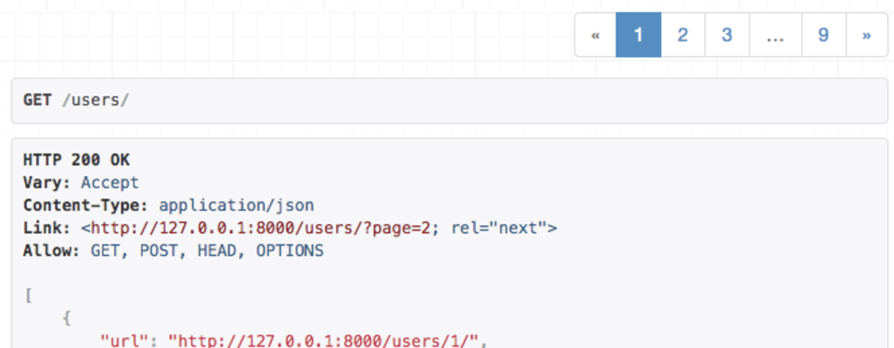

# Django REST Framework - Pagination

---

_"Django provides a few classes that help you manage paginated data – that is, data that’s split across several pages, with “Previous/Next” links."_  

_"Django는 페이지가 매겨진 데이터, 즉 "이전 / 다음" 링크를 사용하여 여러 페이지로 나누어 진 데이터를 관리하는데 도움이 되는 몇가지 클래스를 제공합니다."_  

_— Django documentation_

---

## Pagination

REST 프레임워크는 custom 가능한 pagination 스타일을 지원합니다. 이렇게 하면 큰 result sets을 개별 데이터 페이지로 분할하는 방법을 수정할 수 있습니다.  

pagination API는 다음 중 하나를 지원할 수 있습니다.

- resopnse 내용의 일부로 제공되는 pagination 링크
- `Content-Range` 또는 `Link`와 같은 response header에 포함 된 pagination 링크  

내장된 스타일은 현재 response 내용의 일부로 포함된 링크를 사용합니다. 이 스타일은 browsable API를 사용할 때 더 쉽게 액서스 할 수 있습니다.  
pagination은 generic view 또는 viewset를 사용하는 경우에만 자동으로 수행됩니다. 일반 `APIView`를 사용하는 경우 pagination 된 response를 반환하도록 pagination API를 직접 호출해야 합니다. 예를 들어, `mixins.ListModelMixin` 및 `generics.GenericAPIView` 클래스의 소스 코드를 참조하세요.  
pagination 클래스를 `None`으로 설정하면 pagination을 끌 수 있습니다.

### Setting the pagination style
기본 pagination 스타일은 `DEFAULT_PAGINATION_CLASS` 및 `PAGE_SIZE` 설정 키를 사용하여 전체적으로 설정할 수 있습니다. 예를 들어 내장 된 limit / offset pagination을 사용하려면 다음과 같이 하면 됩니다.

```python
REST_FRAMEWORK = {
    'DEFAULT_PAGINATION_CLASS': 'rest_framework.pagination.LimitOffsetPagination',
    'PAGE_SIZE': 100
}
```

pagination 클래스와 사용할 페이지 크를 모두 설정해야 합니다.  

`pagination_class`속성을 사용하여 개별 view에서 pagination 클래스를 설정 할 수도 있습니다. 일반적으로 API 전체에서 동일한 pagination 스타일을 사용하고 싶지만 view마다 기본 페이지 또는 최대 페이지 크기가 같은 pagination의 개별적인 측면을 바꿀 수도 있습니다.

### Modifying the pagination style
pagination 스타일의 특정 측면을 수정하려면 pagination 클래스 중 하나를 오버라이드하고 변경하려는 속성을 설정해야 합니다.

```python
class LargeResultsSetPagination(PageNumberPagination):
    page_size = 1000
    page_size_query_param = 'page_size'
    max_page_size = 10000

class StandardResultsSetPagination(PageNumberPagination):
    page_size = 100
    page_size_query_param = 'page_size'
    max_page_size = 1000
```
그런 다음 `.pagination_class` 속성을 사용하여 뷰에 새 스타일을 적용 할 수 있습니다.

```python
class BillingRecordsView(generics.ListAPIView):
    queryset = Billing.objects.all()
    serializer_class = BillingRecordsSerializer
    pagination_class = LargeResultsSetPagination
```
또는 `DEFAULT_PAGINATION_CLASS` 설정 키를 사용하여 스타일을 전역적으로 적용하세요. 예:

```python
REST_FRAMEWORK = {
    'DEFAULT_PAGINATION_CLASS': 'apps.core.pagination.StandardResultsSetPagination'
}
```

---

## API Reference

### PageNumberPagination
이 pagination 스타일은 request 쿼리 parameter에 단일 숫자 페이지 번호를 허용합니다.

**Request**:  

```
GET https://api.example.org/accounts/?page=4
```

**Response**:

```
HTTP 200 OK
{
    "count": 1023
    "next": "https://api.example.org/accounts/?page=5",
    "previous": "https://api.example.org/accounts/?page=3",
    "results": [
       …
    ]
}
```

#### Setup
`PageNumberPagination`스타일을 전역적으로 사용하려면 다음 구성을 사용하여 `PAGE_SIZE`를 원하는대로 수정하세요.

```python
REST_FRAMEWORK = {
    'DEFAULT_PAGINATION_CLASS': 'rest_framework.pagination.PageNumberPagination',
    'PAGE_SIZE': 100
}
```

`GenericAPIView` 서브 클래스에서 `pagination_class`속성을 설정하여 페이지 단위로 `PageNumberPagination`을 선택할 수도 있습니다.  

#### Configuration (구성)
`PageNumberPagination`클래스는 pagination 스타일을 수정하기 위해 오버라이드 될 수 있는 여러 속성을 포함합니다.  
이러한 속성을 설정하려면 `PageNumberPagination`클래스를 오버라이드 한 다음 위와 같이 custom pagination 클래스를 활성화해야합니다.  

- `django_paginator_class` : 사용할 Django Paginator 클래스입니다. 기본값은 `django.core.paginator.Paginator`입니다. 대부분의 사용 사례에서 괜찮습니다.
- `page_size` : 페이지 크기를 나타내는 숫자 값입니다. 설정된 경우 `PAGE_SIZE` 설정보다 우선합니다. 기본값은 `PAGE_SIZE` 설정 키와 동일한 값입니다.
- `page_query_param` : pagination 컨트롤에 사용할 쿼리 parameter의 이름을 나타내는 문자열 값입니다.
- `page_size_query_param` : 설정된 경우 클라이언트가 request 별로 페이지 크기를 설정할 수 있도록하는 쿼리 parameter의 이름을 나타내는 문자열 값입니다. 기본값은 `None`으로, 클라이언트가 요청 된 페이지 크기를 제어 할 수 없음을 나타냅니다.
- `max_page_size` : 설정되면 request 된 최대 페이지 크기를 나타내는 숫자 값입니다. 이 속성은 `page_size_query_param`도 설정되어있는 경우에만 유효합니다.
- `last_page_strings` : `page_query_param`과 함께 사용되어 최종 페이지를 요청할 수있는 값을 나타내는 문자열 값의 list 또는 tuple 입니다. 기본값은 `('last',)` 입니다.
- `template` : browsable API에서 pagination 컨트롤을 렌더링 할 때 사용할 템플릿의 이름입니다. 렌더링 스타일을 수정하기 위해 오버라이드 되거나 HTML pagination 컨트롤을 완전히 비활성화하려면 `None`으로 설정 할 수 있습니다. 기본값은 `"rest_framework / pagination / numbers.html"`입니다.

---

### LimitOffsetPagination
이 pagination 스타일은 여러 데이터베이스 레코드를 찾을 때 사용되는 구문을 반영합니다. 클라이언트에는 "limit"와 "offset" 쿼리 parameter가 모두 포함됩니다. **limit** 는 반환 할 최대 항목 수를 나타내며 다른 스타일의 `page_size`와 같습니다. **offset**은 unpaginated 된 항목의 완성된 set과 관련하여 쿼리의 시작 위치를 나타냅니다.

**Request**:

```
GET https://api.example.org/accounts/?limit=100&offset=400
```

**response**:

```python
HTTP 200 OK
{
    "count": 1023
    "next": "https://api.example.org/accounts/?limit=100&offset=500",
    "previous": "https://api.example.org/accounts/?limit=100&offset=300",
    "results": [
       …
    ]
}
```

#### Setup
`LimitOffsetPagination` 스타일을 전역적으로 사용하려면 다음 구성을 사용하세요.

```python
REST_FRAMEWORK = {
    'DEFAULT_PAGINATION_CLASS': 'rest_framework.pagination.LimitOffsetPagination'
}
```
선택적으로 `PAGE_SIZE` 키를 설정 할 수도 있습니다. `PAGE_SIZE` parameter도 사용되는 경우 `limit` 쿼리 parameter는 선택사항이며 클라이언트가 생략할 수 있습니다.  
`GenericAPIView` 서브 클래스에서는 `pagination_class`속성을 설정하여 각 뷰별로 `LimitOffsetPagination`을 선택할 수 있습니다.  

#### Configuration
`LimitOffsetPagination` 클래스에는pagination 스타일을 수정하기 위해 오버라이드 할 수 있는 많은 속성이 포함되어 있습니다.  
이러한 속성을 설정하려면 `LimitOffsetPagination`클래스를 오버라이드 한 다음 위와 같이 custom pagination 클래스를 활성화해야 합니다.

- `default_limit` : 쿼리 parameter에서 클라이언트가 제공하지 않을 경우 사용할 제한을 나타내는 숫자 값입니다. 기본값은 `PAGE_SIZE` 설정 키와 동일한 값입니다.
- `limit_query_param` : "limit" 쿼리 parameter의 이름을 나타내는 문자열 값입니다. 기본값은 `'limit'`입니다.
- `offset_query_param` : "offset" 쿼리 parameter의 이름을 나타내는 문자열 값입니다. 기본값은 `'offset'`입니다.
- `max_limit` : 설정된 경우 클라이언트가 요청할 수있는 최대 허용 한계를 나타내는 숫자 값입니다. 기본값은 `None`입니다.
- `template` : browsable API에서 페이지 매김 컨트롤을 렌더링 할 때 사용할 템플릿의 이름입니다. 렌더링 스타일을 수정하기 위해 오버라이드 되거나 HTML pagination 컨트롤을 완전히 비활성화하려면 `None`으로 설정 될 수 있습니다. 기본값은 `"rest_framework / pagination / numbers.html"`입니다.

---

### CursorPagination
cursor 기반 pagination은 클라이언트가 result set를 통해 페이지 할 때 사용할 수 있는 불투명한 "cursor" 지시자를 제공합니다. 이 pagination 스타일은 정방향 및 역방향 컨트롤만 제공하며 클라이언트가 임의의 위치로 이동할 수 없도록 합니다.  
cursor를 기반으로 pagination을 수행하려면 result set에 items의 순서가 변경되지 않아야 합니다. 일반적으로 이 순서는 레코드에 대한 생성 timestamp 일 수 있습니다. 이는 pagination 순서를 일관되게 유지하기 때문입니다.  
cursor 기반 pagination은 다른 스키마보다 복잡합니다. 또한 result set이 고정 된 순서를 제공해야하며 클라이언트가 임의로 result set에 색인을 작성할 수 없도록 해야합니다. 그러나 다음과 같은 이점을 제공합니다.

- 일관된 pagination 을 제공합니다. 제대로 사용하면 `CursorPagination`은 pagination 과정에서 다른 클라이언트가 새 항목을 삽입하는 경우에도 클라이언트가 레코드를 페이징 할 때 동일한 item을 두번 보지 못하게 합니다.
- 매우 큰 데이터 set 사용을 지원합니다. 극도로 큰 데이터 set의 경우 offset 기반 pagination 스타일을 사용하는 pagination이 비효율적이거나 사용할 수 없게 될 수 있습니다. 대신 cursor 기반 pagination 스키마는 고정 시간 속성을 가지며 데이터 set 크기가 커질수록 속도가 느려지지 않습니다.

#### Details and limitations
cursor 기반의 pagination을 올바르게 사용하려면 세부 사항에 약간의 주의가 필요합니다. 우리는 계획을 적용하기를 원하는 순서에 대해 생각할 필요가 있습니다. 기본값은 `"-created"`입니다. 여기에는 모델 인스턴스에 **'created' timestamp 필드가 꼭 있어야하며** 가장 최근에 추가 된 항목이 먼저 나오는 "timeline" 스타일 pagination view가 제공됩니다.  
pagination 클래스의 `'ordering'`속성을 무시하거나 `OrderingFilter` 필터 클래스를 `CursorPagination`과 함께 사용하여 순서를 수정할 수 있습니다. `OrderingFilter`와 함께 사용하는 경우 사용자가 주문 할 수 있는 입력란을 제한하는 것이 좋습니다.  

커서 pagination 을 올바르게 사용하려면 다음을 만족시키는 ordering 필드가 있어야 합니다.

- 생성시 timestamp, slug 또는 한번만 설정되는 다른 필드와 같은 변경되지 않은 값이어야 합니다.
- 고유하거나 거의 고유해야합니다. Millisecond 정밀도 timestamp가 좋은 예입니다. 이 cursor pagination의 구현은 똑똑한 "position plus offset"스타일을 사용하여 엄격하게 고유하지 않은 값을 순서대로 올바르게 지원할 수 있습니다.
- null이 허용하지 않는 값이어야 합니다.(문자열로 강제 변환 될 수 있습니다.)
- 필드에는 데이터베이스 색인이 있어야합니다.

이러한 제약 조건을 만족시키지 못하는 ordering field를 사용하면 일반적으로 작동하지만 cursor pagination의 이점을 일부 상실하게 됩니다.  
cursor pagination에 사용되는 구현에 대한 자세한 정보는 ["Building cursors for the Disqus API"](http://cramer.io/2011/03/08/building-cursors-for-the-disqus-api)블로그 게시물에서 기본 접근 방법에 대한 개요를 제공합니다.

#### Setup
`CursorPagination` 스타일을 전역적으로 사용하려면 다음 구성을 사용하여 `PAGE_SIZE`를 원하는대로 수정하십시오.

```python
REST_FRAMEWORK = {
    'DEFAULT_PAGINATION_CLASS': 'rest_framework.pagination.CursorPagination',
    'PAGE_SIZE': 100
}
```
`GenericAPIView` 서브 클래스에서 `pagination_class` 속성을 설정하여 뷰 단위로 `CursorPagination`을 선택할 수도 있습니다.

#### Configuration
`CursorPagination` 클래스에는 pagination 스타일을 수정하기 위해 오버라이드 될 수 있는 많은 속성이 포함되어 있습니다.  

이러한 속성을 설정하려면 `CursorPagination`클래스를 오버라이드 한 다음 위와 같이 custom pagination 클래스를 활성화해야 합니다.

- `page_size` : 페이지 크기를 나타내는 숫자 값입니다. 설정된 경우 `PAGE_SIZE` 설정보다 우선합니다. 기본값은 `PAGE_SIZE` 설정 키와 동일한 값입니다
- `cursor_query_param` : "cursor" 쿼리 parameter의 이름을 나타내는 문자열 값입니다. 기본값은 `'cursor'`입니다.
- `ordering` : cursor 기반의 pagiation이 적용될 필드를 나타내는 문자열 또는 문자열 list 이어야합니다. (예: `ordering = 'slug'`) 기본값은 `-created`입니다. 뷰에서 `OrderingFilter`를 사용하여 이 값을 오버라이드 할 수도 있습니다.
- `template` :  browsable API에서  pagination 컨트롤을 렌더링 할 때 사용할 템플릿의 이름입니다. 렌더링 스타일을 수정하기 위해 오버라이드 되거나 HTML pagination 컨트롤을 완전히 비활성화하려면 `None`으로 설정 될 수 있습니다. 기본값은 `"rest_framework/pagination/previous_and_next.html"`입니다.

---

## Custom pagination styles
Custom pagination serializer 클래스를 생성하려면 `pagination.BasePagination`을 서브 클래스화하고 `paginate_queryset(self, queryset, request, view = None)` 및 `get_paginated_response(self, data)` 메소드를 오버라이드 해야합니다.

- `paginate_queryset` 메소드는 초기 쿼리셋을 전달 받고 요청 된 페이지의 데이터만 포함하는 반복 가능한 객체를 반환해야합니다.
- `get_paginated_response` 메소드는 serializer 된 페이지 데이터를 전달 받고 Response 인스턴스를 반환해야합니다.

`paginate_queryset` 메소드는 페이지 설정 인스턴스에 상태를 설정할 수 있으며 나중에 `get_paginated_response` 메소드에서 사용할 수 있습니다.

### Example
기본 pagination output 스타일을 중첩 된 'links' 키 아래의 다음 링크와 이전 링크를 포함하는 수정된 형식으로 바꾸려한다고 가정합니다. 다음과 같이 custom pagination 클래스를 지정할 수 있습니다.

```python
class CustomPagination(pagination.PageNumberPagination):
    def get_paginated_response(self, data):
        return Response({
            'links': {
               'next': self.get_next_link(),
               'previous': self.get_previous_link()
            },
            'count': self.page.paginator.count,
            'results': data
        })
```
그런 다음 구성에서 custom 클래스를 설정해야합니다

```python
REST_FRAMEWORK = {
    'DEFAULT_PAGINATION_CLASS': 'my_project.apps.core.pagination.CustomPagination',
    'PAGE_SIZE': 100
}
```
browsable API의 response에서 키의 순서가 어떻게 표시되는지 신경 쓰면 pagination 된 response의 본문을 구성할 때 `OrderedDict`를 사용하도록 선택할 수 있지만 선택사항입니다.

### Header based pagination
내장 된 `PageNumberPagination` 스타일을 수정하여 response 본문에 pagination 링크를 포함하는 대신 [GitHub API와 비슷한 스타일](https://developer.github.com/guides/traversing-with-pagination/)로 `link` 헤더를 포함합니다.

```python
class LinkHeaderPagination(pagination.PageNumberPagination):
    def get_paginated_response(self, data):
        next_url = self.get_next_link()
        previous_url = self.get_previous_link()

        if next_url is not None and previous_url is not None:
            link = '<{next_url}>; rel="next", <{previous_url}>; rel="prev"'
        elif next_url is not None:
            link = '<{next_url}>; rel="next"'
        elif previous_url is not None:
            link = '<{previous_url}>; rel="prev"'
        else:
            link = ''

        link = link.format(next_url=next_url, previous_url=previous_url)
        headers = {'Link': link} if link else {}

        return Response(data, headers=headers)
```

### Using your custom pagination class
custom pagination 클래스를 기본적으로 사용하려면 `DEFAULT_PAGINATION_CLASS` 설정을 사용하세요.

```python
REST_FRAMEWORK = {
    'DEFAULT_PAGINATION_CLASS': 'my_project.apps.core.pagination.LinkHeaderPagination',
    'PAGE_SIZE': 100
}
```
이제 endpoint에 대한 API response에는 페이지 본문 링크를 response 본문의 일부로 포함하는 대신 `link`헤더가 포함됩니다.

### Pagination & schemas
또한 `coreapi.Field` 인스턴스의 list를 반환해야하는 `get_schema_fields()` 메소드를 구현하여 REST 프레임워크가 제공하는 스키마 자동 생성에서 pagination 컨트롤을 사용할 수 있게 만들 수 있습니다.

---


`link`헤더를 사용하는 custom pagination 스타일

---

## HTML pagination controls

기본적으로 pagination 클래스를 사용하면 browsable API에 HTML pagination 컨트롤이 표시됩니다. 두 가지 내장 디스플레이 스타일이 있습니다. `PageNumberPagination` 및 `LimitOffsetPagination` 클래스는 이전 및 다음 컨트롤이 포함 된 페이지 번호 목록을 표시합니다. `CursorPagination` 클래스는 이전 및 다음 컨트롤만 표시하는 보다 단순한 스타일을 표시합니다.

### Customizing the controls
HTML pagination 컨트롤을 렌더링하는 템플릿을 오버라이드 할 수 있습니다. 두 가지 기본 제공 스타일은 다음과 같습니다.

- rest_framework/pagination/numbers.html
- rest_framework/pagination/previous_and_next.html

전역 템플릿 디렉토리에 이러한 경로 중 하나가 있는 템플릿을 제공하면 관련 pagination 클래스의 기본 렌더링이 무시됩니다.  
또는 기존 클래스를 하위 클래스로 분류하고 클래스의 속성으로 `template = None`을 설정하여 HTML  pagination 컨트롤을 완전히 비활성화 할 수 있습니다. 그런 다음 custom 클래스를 기본 pagination 스타일로 사용하려면 `DEFAULT_PAGINATION_CLASS` 설정 키를 구성해야합니다.  

#### Low-level API
pagination 클래스가 컨트롤을 표시할지 어떨지를 결정하기 위한 저레벨의 API는, pagination 인스턴스의 `display_page_controls` 속성으로서 공개되고 있습니다. HTML pagination 컨트롤을 표시해야하는 경우 `paginate_queryset` 메서드에서  custom pagination 클래스를 `True`로 설정해야합니다.  
`.to_html()` 및 `.get_html_context()` 메소드는 컨트롤이 렌더링되는 방식을 추가로 custom하기 위해 custom pagination 클래스에서 오버라이드 될 수도 있습니다.

## Third party packages
다음의 타사 패키지도 제공됩니다.

### DRF-extensions
[`DRF-extensions` 패키지](http://chibisov.github.io/drf-extensions/docs/)에는 [`PaginateByMaxMixin` mixin 클래스](http://chibisov.github.io/drf-extensions/docs/#paginatebymaxmixin)가 포함되어있어 API 클라이언트가 허용되는 최대 페이지 크기를 얻기 위해`?page_size=max`를 지정할 수 있습니다.

### drf-proxy-pagination
[`drf-proxy-pagination` 패키지](https://github.com/tuffnatty/drf-proxy-pagination)는 쿼리 parameter로 pagination 클래스를 선택할 수 있는 `ProxyPagination` 클래스를 포함합니다.
