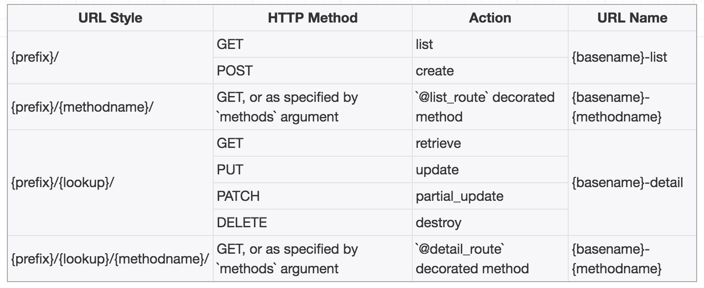
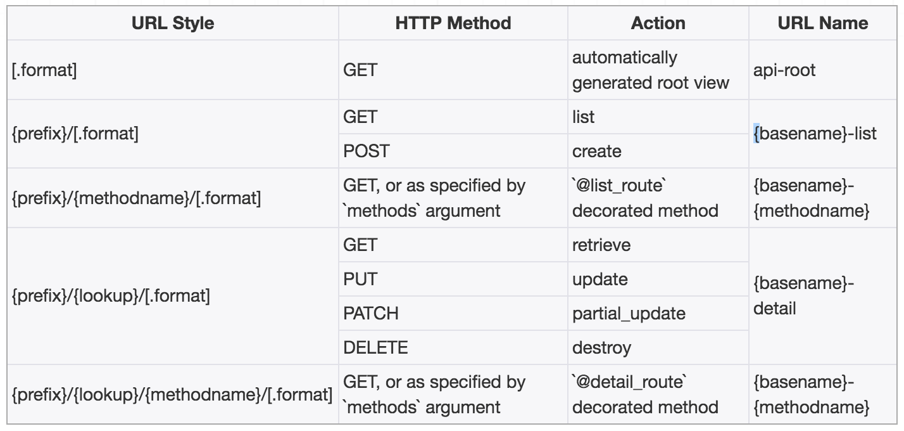

# Django REST Framework - Routers

---

_"Resource routing allows you to quickly declare all of the common routes for a given resourceful controller. Instead of declaring separate routes for your index... a resourceful route declares them in a single line of code."_  

_"리소스 라우팅을 사용하면 주어진 리소스가 많은 컨트롤러에 대한 모든 일반 경로를 빠르게 선언 할 수 있습니다. 인덱스에 대해 별도의 경로를 선언하는 대신... 유용한 루트는 코드 한 줄로 선언합니다."_  

_— Ruby on Rails Documentation_

---

## Routers
`Rails`와 같은 일부 웹 프레임워크는 응용 프로그램의 URL을 들어오는 요청을 처리하는 논리에 매핑하는 방법을 자동으로 결정하는 기능을 제공합니다.  
REST 프레임워크는 Django에 대한 자동 URL라우팅을 지원을 추가하고 뷰 로직을 URL set에 간단하고 빠르게 연관되게 연결하는 방법을 제공합니다.

### Usage
다음은 `SimpleRouter`를 사용하는 간단한 URL 구성의 예입니다.

```python
from rest_framework import routers

router = routers.SimpleRouter()
router.register(r'users', UserViewSet)
router.register(r'accounts', AccountViewSet)
urlpatterns = router.urls
```
`register()`메서드는 두 가지 필수 인수가 있습니다.  

- `prefix` : router의 set에 사용할 URL접두어 입니다.
- `viewset` : `viewset`클래스입니다.

선택적으로 추가 인수를 지정할 수도 있습니다.

- `Base_name` : 작성된 URL 이름에 사용합니다. 설정되지 않은 경우 기본이름은 viewset의 쿼리셋 속성을 기반으로 자동 생성됩니다. viewset에 쿼리셋 특성이 포함되어 있지 않으면 viewset을 등록할 때  `base_name`을 설정해야 합니다.  

위의 예는 다음 URL패턴을 생성합니다.  

- URL pattern: `^users/$` Name: `'user-list'`
- URL pattern: `^users/{pk}/$` Name: `'user-detail'`
- URL pattern: `^accounts/$` Name: `'account-list'`
- URL pattern: `^accounts/{pk}/$` Name: `'account-detail'`

---
**Note**: `base_name`인수는 뷰 이름 패턴의 초기 부분을 지정하는데 사용됩니다. 위의 예에서는 사용자나 계정 부분입니다.  
일반적으로 `base_name`인수를 지정할 필요는 없지만, custom `get_queryset`메서드를 정의한 viewset이 있는 경우, viewset에는 `.queryset` 속성 set이 없을 수 있습니다. 해당 viewset을 등록하려고하면 다음과 같은 오류가 표시됩니다.

```
'base_name' argument not specified, and could not automatically determine the name from the viewset, as it does not have a '.queryset' attribute.
```
즉, 모델 이름에서 자동으로 결정할 수 없으므로 viewset을 등록할 때 `base_name`인수를 명시적으로 설정해야 합니다.

---

#### Using include with routers
라우터 인스턴스의 `.urls`속성은 URL 패턴의 표준 list일 뿐입니다. 이러한 URL을 포함할 수 있는 방법에는 여러 스타일이 있습니다.  
예를 들어 `router.urls`를 views 목록에 추가할 수 있습니다.

```python
router = routers.SimpleRouter()
router.register(r'users', UserViewSet)
router.register(r'accounts', AccountViewSet)

urlpatterns = [
    url(r'^forgot-password/$', ForgotPasswordFormView.as_view()),
]

urlpatterns += router.urls
```
또는 Django의 `include` 함수를 사용할 수 있습니다.

```python
urlpatterns = [
    url(r'^forgot-password/$', ForgotPasswordFormView.as_view()),
    url(r'^', include(router.urls)),
]
```
라우터 URL 패턴도 네임스페이스가 될 수 있습니다.

```python
urlpatterns = [
    url(r'^forgot-password/$', ForgotPasswordFormView.as_view()),
    url(r'^api/', include(router.urls, namespace='api')),
]
```
하이퍼링크가 있는 serializer와 함께 네임 스페이스를 사용하는 경우  serializer의 `view_name` parameter가 네임 스페이스를 올바르게 반영하는지 확인해야 합니다. 위의 예제에서 사용자 detail view에 하이퍼링크 된 serializer 필드에 대해 `view_name='api:user-detail'`과 같은 parameter를 포함해야합니다.

#### Extra link and actions
`@detail_route`나 `@list_route`로 장식 된 viewset의 모든 메서드도 라우트됩니다. 예를 들어, `UserViewSet`클래스에서 다음과 같은 메서드가 제공됩니다.  

```python
from myapp.permissions import IsAdminOrIsSelf
from rest_framework.decorators import detail_route

class UserViewSet(ModelViewSet):
    ...

    @detail_route(methods=['post'], permission_classes=[IsAdminOrIsSelf])
    def set_password(self, request, pk=None):
        ...
```
다음 URL패턴이 추가로 생성됩니다.

- URL pattern: `^users/{pk}/set_password/$` Name: `'user-set-password'`

custom 작업에 대해 생성 된 기본 URL을 사용하지 않으려면  대신 `url_path` parameter를 사용하여 custom 할 수 있습니다.  
예를 들어 custom 액션의 URL을 `^users/{pk}/change-password/$`으로 변경하려면 다음과 같이 작성하세요.

```python
from myapp.permissions import IsAdminOrIsSelf
from rest_framework.decorators import detail_route

class UserViewSet(ModelViewSet):
    ...

    @detail_route(methods=['post'], permission_classes=[IsAdminOrIsSelf], url_path='change-password')
    def set_password(self, request, pk=None):
        ...
```
위의 예제는 이제 다음 URL패턴을 생성합니다.

- URL pattern: `^users/{pk}/change-password/$` Name: `'user-change-password'`

custom 액션에 대해 생성된 기본 이름을 사용하지 않으려는 경우 `url_name`parameter를 사용하여 custom 할 수 있습니다.  
예를 들어, custo,액션의 이름을 `'user-change-password'`로 변경하려면 다음과 같이 작성할 수 있습니다.

```python
from myapp.permissions import IsAdminOrIsSelf
from rest_framework.decorators import detail_route

class UserViewSet(ModelViewSet):
    ...

    @detail_route(methods=['post'], permission_classes=[IsAdminOrIsSelf], url_name='change-password')
    def set_password(self, request, pk=None):
        ...
```
위의 예제는 이제 다음 URL패턴을 생성합니다.

- URL pattern: `^users/{pk}/set_password/$` Name: `'user-change-password'`

또한 `url_path`와 `url_name` parameter를 함께 사용하여 custom view에 대한 URL생성을 제어할 수 있습니다.  
더 자세한 내용은 [marking extra actions for routing](http://www.django-rest-framework.org/api-guide/viewsets/#marking-extra-actions-for-routing)참조하세요.

## API Guide
### SimpleRouter
이 라우터에는 `list`, `create`, `retrieve`, `update`, `partial_update`, `destroy` 표준 set 작업에 대한 경로가 포함됩니다. viewset은 `@detail_route`나 `@list_route`데코레이터를 사용하여 라우트 될 추가 메서드를 표시 할 수고 있습니다.

기본적으로 `SimpleRouter`로 만든 URL 뒤에는 슬래시가 추가됩니다. 이 동작은 라우터를 인스턴스화 할때 `trailing_slash` 인수를 `False`로 설정하여 수정할 수 있습니다. 예:

```
router = SimpleRouter(trailing_slash=False)
```
뒤에 오는 슬래시는 Django에서는 일반적이지만 레일스와 같은 다른 프레임워크에서는 기본적으로 사용되지 않습니다. 어떤 자바스크립트 프레임워크가 특정 라우팅 스타일을 기대할지라도, 어떤 스타일을 선탣 하느냐는 대부분 환경 설정의 문제입니다.  
라우터는 슬래시와 마침표를 제외한 문자가 포함 된 조회값을 매치시킵니다. 보다 제한적인(혹은 관대한) 검색 패턴의 경우, viewset에 `lookup_value_regex`속성을 설정하세요. 예를 들어, 조회를 유효한 `UUID`로 제한할 수 있습니다.

```python
class MyModelViewSet(mixins.RetrieveModelMixin, viewsets.GenericViewSet):
    lookup_field = 'my_model_id'
    lookup_value_regex = '[0-9a-f]{32}'
```

### DefaultRouter
이 라우터는 위와 같이 `SimpleRouter`와 비슷하지만 모든 list views에 대한 하이퍼링크가 포함 된 response을 반환하는 기본 API root view를 추가로 포함합니다. 선택적 `.json` 스타일 형식 접미사에 대한 경로도 생성합니다.  
  
`SimpleRouter`과 마찬가지로 라우터를 인스턴스화 할때 `trailing_slash` 인수를  `False`로 설정하면 URL 경로에 따라오는 슬래시를 제거할 수 있습니다.

```python
router = DefaultRouter(trailing_slash=False)
```

## Custom Routers
`custom router`를 구현하는 것은 자주해야 할 일은 아니지만 `API URL`이 어떻게 구성되는지에 대한 요구사항이 있는 경우 유용합니다. 이렇게 하면 재사용 할 수 있는 방식으로 URL구조를 캡슐화 할 수 있으므로 각 새로운 view에 대해 명시적으로 URL 패턴을 작성 할 필요가 없습니다.  
`custom router`를 구현하는 가장 간단한 방법은 기본 라우터 클래스 중 하나를 서브 클래스로 만드는 것입니다. `.routes` 속성은 각 viewset에 맵핑 될 URL 패턴을 template하는데 사용됩니다. `.routes`속성은 경로지정 튜플의 list입니다.  
`Route`라는 튜플에 대한 인수는 다음과 같습니다.

**url** : 라우트 될 URL을 나타내는 문자열. 다음 타입의 문자열을 포함할 수 있습니다.

- `{prefix}` : 이 경로 집합에 사용할 URL 접두사입니다.  
- `{lookup}` : 단일 인스턴스와 매치시키는데 사용되는 조회 필드입니다.  
- `{trailing_slash}` : `trailing_slash`인수에 따라 `'/'`나 빈 문자열입니다.

**mapping** : HTTP 메서드 이름을 뷰 메서드에 매핑.  

**name** : `reverse` 호출에 사용되는 URL의 이름입니다. 다음 타입의 문자열을 포함 할 수 있씁니다.

- `{basename}` : 생성된 URL 이름에 사용할 기준입니다.

**initkwargs** : view를 인스턴스화 할 때 전달되어야하는 추가 인수의 dict. `suffix`인수는 뷰 이름과 탐색 경로 링크를 생성 할 떄 사용되는 viewset 유형을 식별하기 위해 예약되어 있습니다.

### Customizing dynamic routes
`@list_route`와 `@detail_route`데코레이터가 라우팅되는 방법을 custom 할 수 있습니다. 이 데코레이터 중 하나나 모두를 라우트하려면 `.routes`목록에 `DynamicListRoute`와 `/`이나 `DynamicDetailRoute`라는 이름의 튜플을 포함하세요.  
`DynamicListRoute`와 `DynamicDetailRoute`의 인수는 다음과 같습니다.  

**url** : 라우트 될 URL을 나타내는 문자열. `Route`와 동일한 타입의 문자열을 포함할 수 있으며, `{methodname}`과 `{methodnamehyphen}`형식 문자열을 추가로 허용합니다.  

**name** : `reverse`호출에 사용되는 URL의 이름입니다. `{basename}`, `{methodname}` 및 `{methodnamehyphen}`과 같은 형식 문자열을 포함합니다.  

**initkwargs** : 뷰를 인스턴스화 할 때 전달되어야 하는 추가 인수의 dict

### Example
다음 예는 'list'와 'retrieve`의 액션에만 라우팅하며, 후행 슬래시 규칙은 사용하지 않습니다.

```python
from rest_framework.routers import Route, DynamicDetailRoute, SimpleRouter

class CustomReadOnlyRouter(SimpleRouter):
    """
    A router for read-only APIs, which doesn't use trailing slashes.
    """
    routes = [
        Route(
            url=r'^{prefix}$',
            mapping={'get': 'list'},
            name='{basename}-list',
            initkwargs={'suffix': 'List'}
        ),
        Route(
            url=r'^{prefix}/{lookup}$',
            mapping={'get': 'retrieve'},
            name='{basename}-detail',
            initkwargs={'suffix': 'Detail'}
        ),
        DynamicDetailRoute(
            url=r'^{prefix}/{lookup}/{methodnamehyphen}$',
            name='{basename}-{methodnamehyphen}',
            initkwargs={}
        )
    ]
```
`CustomReadOnlyRouter`가 간단한 viewset을 위해 생성 할 라우트를 살펴 보겠습니다.

`views.py`:  

```python
class UserViewSet(viewsets.ReadOnlyModelViewSet):
    """
    A viewset that provides the standard actions
    """
    queryset = User.objects.all()
    serializer_class = UserSerializer
    lookup_field = 'username'

    @detail_route()
    def group_names(self, request):
        """
        Returns a list of all the group names that the given
        user belongs to.
        """
        user = self.get_object()
        groups = user.groups.all()
        return Response([group.name for group in groups])
```
`urls.py` :

```python
router = CustomReadOnlyRouter()
router.register('users', UserViewSet)
urlpatterns = router.urls
```
다음과 같은 매칭이 생성됩니다...

URL	| HTTP Method| Action	| URL Name
---|---|---|---
/users	| GET	| list	| user-list
/users/{username}	| GET	| retrieve	| user-detail
/users/{username}/group-names	| GET	| group_names	| user-group-names

`.routes`속성을 설정하는 다른 예제는 `SimpleRouter`클래스의 소스 코드를 참조하세요.

### Advanced custom routers
완전히 custom된 동작을 제공하려면 `BaseRouter`를 대체하고 `get_urls(self)`메서드를 대체할 수 있습니다. 이 메서드는 등록 된 viewset을 검사하고, URL 패턴 list를 리턴해야합니다. 등록된 prefix, viewset, basename 튜플은 `self.registry`속성에 액서스하여 검사할 수 있습니다.  
`get_default_base_name(self, viewset)`메서드를 오버라이드하거나, viewset을 라우터에 등록 할 때 항상 `base_name` 인수를 명시적으로 설정할 수 있습니다.

## Third Party Packages
다음의 타사 패키지도 제공됩니다.

### DRF Nested Routers
[`drf-nested-routers`패키지](https://github.com/alanjds/drf-nested-routers)는 중첩된 리소스로 작업하기 위한 라우터와 관계 필드를 제공합니다.

### ModelRouter (wq.db.rest)
[`wq.db 패키지`](https://wq.io/wq.db)는 `register_model()` API로 `DefaultRouter`를 확장하는 고급 [`ModelRouter`](https://wq.io/1.0/docs/router) 클래스(및 싱글 톤 인스턴스)를 제공합니다. Django의 `admin.site.register`와 마찬가지로 `rest.router.register_model`에 필요한 유일한 인수는 모델 클래스입니다. url prefix, serializer, viewset에 대한 합리적인 기본값은 모델과 전역구성에서 유추됩니다.  

```python
from wq.db import rest
from myapp.models import MyModel

rest.router.register_model(MyModel)
```

### DRF-extensions
[`DRF-extensions` package](http://chibisov.github.io/drf-extensions/docs/)는 [중첩된 viewset](http://chibisov.github.io/drf-extensions/docs/#nested-routes), [custom가 가능한 엔드포인트 이름](http://chibisov.github.io/drf-extensions/docs/#controller-endpoint-name)을 가진 [콜렉션 레벨 컨트롤러](http://chibisov.github.io/drf-extensions/docs/#collection-level-controllers)를 작성하기 위한 [라우터](http://chibisov.github.io/drf-extensions/docs/#routers)를 제공합니다.
