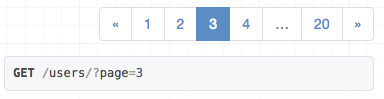
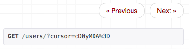

# Django REST framework 3.1

The 3.1 release is an intermediate step in the Kickstarter project releases, and includes a range of new functionality.

Some highlights include:

* A super-smart cursor pagination scheme.
* An improved pagination API, supporting header or in-body pagination styles.
* Pagination controls rendering in the browsable API.
* Better support for API versioning.
* Built-in internationalization support.
* Support for Django 1.8's `HStoreField` and `ArrayField`.

---

## Pagination

The pagination API has been improved, making it both easier to use, and more powerful.

A guide to the headline features follows. For full details, see [the pagination documentation][pagination].

Note that as a result of this work a number of settings keys and generic view attributes are now moved to pending deprecation. Controlling pagination styles is now largely handled by overriding a pagination class and modifying its configuration attributes.

* The `PAGINATE_BY` settings key will continue to work but is now pending deprecation. The more obviously named `PAGE_SIZE` settings key should now be used instead.
* The `PAGINATE_BY_PARAM`, `MAX_PAGINATE_BY` settings keys will continue to work but are now pending deprecation, in favor of setting configuration attributes on the configured pagination class.
* The `paginate_by`, `page_query_param`, `paginate_by_param` and `max_paginate_by` generic view attributes will continue to work but are now pending deprecation, in favor of setting configuration attributes on the configured pagination class.
* The `pagination_serializer_class` view attribute and `DEFAULT_PAGINATION_SERIALIZER_CLASS` settings key **are no longer valid**. The pagination API does not use serializers to determine the output format, and you'll need to instead override the `get_paginated_response` method on a pagination class in order to specify how the output format is controlled.

#### New pagination schemes.

Until now, there has only been a single built-in pagination style in REST framework. We now have page, limit/offset and cursor based schemes included by default.

The cursor based pagination scheme is particularly smart, and is a better approach for clients iterating through large or frequently changing result sets. The scheme supports paging against non-unique indexes, by using both cursor and limit/offset information. It also allows for both forward and reverse cursor pagination. Much credit goes to David Cramer for [this blog post](https://cra.mr/2011/03/08/building-cursors-for-the-disqus-api) on the subject.

#### Pagination controls in the browsable API.

Paginated results now include controls that render directly in the browsable API. If you're using the page or limit/offset style, then you'll see a page based control displayed in the browsable API:

The cursor based pagination renders a more simple style of control:

#### Support for header-based pagination.

The pagination API was previously only able to alter the pagination style in the body of the response. The API now supports being able to write pagination information in response headers, making it possible to use pagination schemes that use the `Link` or `Content-Range` headers.

For more information, see the [custom pagination styles](../api-guide/pagination/#custom-pagination-styles) documentation.

---

## Versioning

We've made it [easier to build versioned APIs][versioning]. Built-in schemes for versioning include both URL based and Accept header based variations.

When using a URL based scheme, hyperlinked serializers will resolve relationships to the same API version as used on the incoming request.

For example, when using `NamespaceVersioning`, and the following hyperlinked serializer:

    class AccountsSerializer(serializer.HyperlinkedModelSerializer):
        class Meta:
            model = Accounts
            fields = ('account_name', 'users')

The output representation would match the version used on the incoming request. Like so:

    GET http://example.org/v2/accounts/10  # Version 'v2'

    {
        "account_name": "europa",
        "users": [
            "http://example.org/v2/users/12",  # Version 'v2'
            "http://example.org/v2/users/54",
            "http://example.org/v2/users/87"
        ]
    }

---

## Internationalization

REST framework now includes a built-in set of translations, and [supports internationalized error responses][internationalization]. This allows you to either change the default language, or to allow clients to specify the language via the `Accept-Language` header.

You can change the default language by using the standard Django `LANGUAGE_CODE` setting:

    LANGUAGE_CODE = "es-es"

You can turn on per-request language requests by adding `LocalMiddleware` to your `MIDDLEWARE_CLASSES` setting:

    MIDDLEWARE_CLASSES = [
        ...
        'django.middleware.locale.LocaleMiddleware'
    ]

When per-request internationalization is enabled, client requests will respect the `Accept-Language` header where possible. For example, let's make a request for an unsupported media type:

**Request**

    GET /api/users HTTP/1.1
    Accept: application/xml
    Accept-Language: es-es
    Host: example.org

**Response**

    HTTP/1.0 406 NOT ACCEPTABLE

    {
        "detail": "No se ha podido satisfacer la solicitud de cabecera de Accept."
    }

Note that the structure of the error responses is still the same. We still have a `detail` key in the response. If needed you can modify this behavior too, by using a [custom exception handler][custom-exception-handler].

We include built-in translations both for standard exception cases, and for serializer validation errors.

The full list of supported languages can be found on our [Transifex project page](https://www.transifex.com/django-rest-framework-1/django-rest-framework/).

If you only wish to support a subset of the supported languages, use Django's standard `LANGUAGES` setting:

    LANGUAGES = [
        ('de', _('German')),
        ('en', _('English')),
    ]

For more details, see the [internationalization documentation][internationalization].

Many thanks to [Craig Blaszczyk](https://github.com/jakul) for helping push this through.

---

## New field types

Django 1.8's new `ArrayField`, `HStoreField` and `UUIDField` are now all fully supported.

This work also means that we now have both `serializers.DictField()`, and `serializers.ListField()` types, allowing you to express and validate a wider set of representations.

If you're building a new 1.8 project, then you should probably consider using `UUIDField` as the primary keys for all your models. This style will work automatically with hyperlinked serializers, returning URLs in the following style:

    http://example.org/api/purchases/9b1a433f-e90d-4948-848b-300fdc26365d

---

## ModelSerializer API

The serializer redesign in 3.0 did not include any public API for modifying how ModelSerializer classes automatically generate a set of fields from a given mode class. We've now re-introduced an API for this, allowing you to create new ModelSerializer base classes that behave differently, such as using a different default style for relationships.

For more information, see the documentation on [customizing field mappings][customizing-field-mappings] for ModelSerializer classes.

---

## Moving packages out of core

We've now moved a number of packages out of the core of REST framework, and into separately installable packages. If you're currently using these you don't need to worry, you simply need to `pip install` the new packages, and change any import paths.

We're making this change in order to help distribute the maintenance workload, and keep better focus of the core essentials of the framework.

The change also means we can be more flexible with which external packages we recommend. For example, the excellently maintained [Django OAuth toolkit](https://github.com/jazzband/django-oauth-toolkit) has now been promoted as our recommended option for integrating OAuth support.

The following packages are now moved out of core and should be separately installed:

* OAuth - [djangorestframework-oauth](https://jpadilla.github.io/django-rest-framework-oauth/)
* XML - [djangorestframework-xml](https://jpadilla.github.io/django-rest-framework-xml/)
* YAML - [djangorestframework-yaml](https://jpadilla.github.io/django-rest-framework-yaml/)
* JSONP - [djangorestframework-jsonp](https://jpadilla.github.io/django-rest-framework-jsonp/)

It's worth reiterating that this change in policy shouldn't mean any work in your codebase other than adding a new requirement and modifying some import paths. For example to install XML rendering, you would now do:

    pip install djangorestframework-xml

And modify your settings, like so:

    REST_FRAMEWORK = {
        'DEFAULT_RENDERER_CLASSES': [
            'rest_framework.renderers.JSONRenderer',
            'rest_framework.renderers.BrowsableAPIRenderer',
            'rest_framework_xml.renderers.XMLRenderer'
        ]
    }

Thanks go to the latest member of our maintenance team, [José Padilla](https://github.com/jpadilla/), for handling this work and taking on ownership of these packages.

---

## Deprecations

The `request.DATA`, `request.FILES` and `request.QUERY_PARAMS` attributes move from pending deprecation, to deprecated. Use `request.data` and `request.query_params` instead, as discussed in the 3.0 release notes.

The ModelSerializer Meta options for `write_only_fields`, `view_name` and `lookup_field` are also moved from pending deprecation, to deprecated. Use `extra_kwargs` instead, as discussed in the 3.0 release notes.

All these attributes and options will still work in 3.1, but their usage will raise a warning. They will be fully removed in 3.2.

---

## What's next?

The next focus will be on HTML renderings of API output and will include:

* HTML form rendering of serializers.
* Filtering controls built-in to the browsable API.
* An alternative admin-style interface.

This will either be made as a single 3.2 release, or split across two separate releases, with the HTML forms and filter controls coming in 3.2, and the admin-style interface coming in a 3.3 release.

[custom-exception-handler]: ../api-guide/exceptions.md#custom-exception-handling
[pagination]: ../api-guide/pagination.md
[versioning]: ../api-guide/versioning.md
[internationalization]: ../topics/internationalization.md
[customizing-field-mappings]: ../api-guide/serializers.md#customizing-field-mappings
