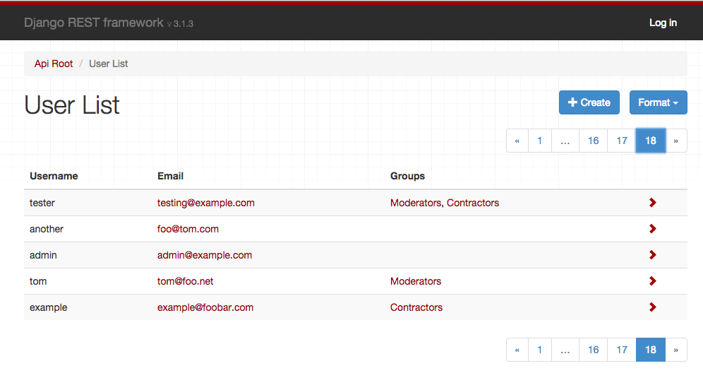

# Django REST framework 3.2

The 3.2 release is the first version to include an admin interface for the browsable API.

This interface is intended to act as a more user-friendly interface to the API. It can be used either as a replacement to the existing `BrowsableAPIRenderer`, or used together with it, allowing you to switch between the two styles as required.

We've also fixed a huge number of issues, and made numerous cleanups and improvements.

Over the course of the 3.1.x series we've [resolved nearly 600 tickets](https://github.com/encode/django-rest-framework/issues?utf8=%E2%9C%93&q=closed%3A%3E2015-03-05) on our GitHub issue tracker. This means we're currently running at a rate of **closing around 100 issues or pull requests per month**.

None of this would have been possible without the support of our wonderful Kickstarter backers. If you're looking for a job in Django development we'd strongly recommend taking [a look through our sponsors](https://www.django-rest-framework.org/community/kickstarter-announcement/#sponsors) and finding out who's hiring.

## AdminRenderer

To include `AdminRenderer` simply add it to your settings:

    REST_FRAMEWORK = {
        'DEFAULT_RENDERER_CLASSES': [
            'rest_framework.renderers.JSONRenderer',
            'rest_framework.renderers.AdminRenderer',
            'rest_framework.renderers.BrowsableAPIRenderer'
        ],
        'DEFAULT_PAGINATION_CLASS': 'rest_framework.pagination.PageNumberPagination',
        'PAGE_SIZE': 100
    }

There are some limitations to the `AdminRenderer`, in particular it is not yet able to handle list or dictionary inputs, as we do not have any HTML form fields that support those.

Also note that this is an initial release and we do not yet have a public API for modifying the behavior or documentation on overriding the templates.

The idea is to get this released to users early, so we can start getting feedback and release a more fully featured version in 3.3.

## Supported versions

This release drops support for Django 1.4.

Our supported Django versions are now 1.5.6+, 1.6.3+, 1.7 and 1.8.

## Deprecations

There are no new deprecations in 3.2, although a number of existing deprecations have now escalated in line with our deprecation policy.

* `request.DATA` was put on the deprecation path in 3.0. It has now been removed and its usage will result in an error. Use the more pythonic style of `request.data` instead.
* `request.QUERY_PARAMS` was put on the deprecation path in 3.0. It has now been removed and its usage will result in an error. Use the more pythonic style of `request.query_params` instead.
* The following `ModelSerializer.Meta` options have now been removed: `write_only_fields`, `view_name`, `lookup_field`. Use the more general `extra_kwargs` option instead.

The following pagination view attributes and settings have been moved into attributes on the pagination class since 3.1. Their usage was formerly in 'pending deprecation', and has now escalated to 'deprecated'. They will continue to function but will raise errors.

* `view.paginate_by` - Use `paginator.page_size` instead.
* `view.page_query_param` - Use `paginator.page_query_param` instead.
* `view.paginate_by_param` - Use `paginator.page_size_query_param` instead.
* `view.max_paginate_by` - Use `paginator.max_page_size` instead.
* `settings.PAGINATE_BY` - Use `paginator.page_size` instead.
* `settings.PAGINATE_BY_PARAM` - Use `paginator.page_size_query_param` instead.
* `settings.MAX_PAGINATE_BY` - Use `paginator.max_page_size` instead.

## Modifications to list behaviors

There are a couple of bug fixes that are worth calling out as they introduce differing behavior.

These are a little subtle and probably won't affect most users, but are worth understanding before upgrading your project.

### ManyToMany fields and blank=True

We've now added an `allow_empty` argument, which can be used with `ListSerializer`, or with `many=True` relationships. This is `True` by default, but can be set to `False` if you want to disallow empty lists as valid input.

As a follow-up to this we are now able to properly mirror the behavior of Django's `ModelForm` with respect to how many-to-many fields are validated.

Previously a many-to-many field on a model would map to a serializer field that would allow either empty or non-empty list inputs. Now, a many-to-many field will map to a serializer field that requires at least one input, unless the model field has `blank=True` set.

Here's what the mapping looks like in practice:

* `models.ManyToManyField()` → `serializers.PrimaryKeyRelatedField(many=True, allow_empty=False)`
* `models.ManyToManyField(blank=True)` → `serializers.PrimaryKeyRelatedField(many=True)`

The upshot is this: If you have many to many fields in your models, then make sure you've included the argument `blank=True` if you want to allow empty inputs in the equivalent `ModelSerializer` fields.

### List fields and allow_null

When using `allow_null` with `ListField` or a nested `many=True` serializer the previous behavior was to allow `null` values as items in the list. The behavior is now to allow `null` values instead of the list.

For example, take the following field:

    NestedSerializer(many=True, allow_null=True)

Previously the validation behavior would be:

* `[{…}, null, {…}]` is **valid**.
* `null` is **invalid**.

Our validation behavior as of 3.2.0 is now:

* `[{…}, null, {…}]` is **invalid**.
* `null` is **valid**.

If you want to allow `null` child items, you'll need to instead specify `allow_null` on the child class, using an explicit `ListField` instead of `many=True`. For example:

    ListField(child=NestedSerializer(allow_null=True))

## What's next?

The 3.3 release is currently planned for the start of October, and will be the last Kickstarter-funded release.

This release is planned to include:

* Search and filtering controls in the browsable API and admin interface.
* Improvements and public API for the admin interface.
* Improvements and public API for our templated HTML forms and fields.
* Nested object and list support in HTML forms.

Thanks once again to all our sponsors and supporters.
