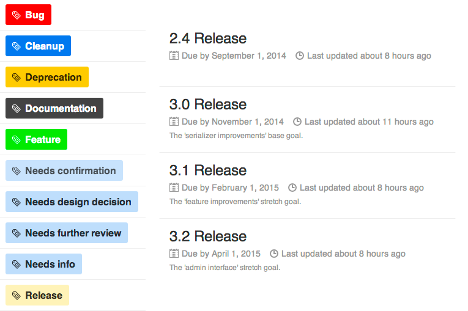

# Django REST framework 2.4

The 2.4 release is largely an intermediate step, tying up some outstanding issues prior to the 3.x series.

## Version requirements

Support for Django 1.3 has been dropped.
The lowest supported version of Django is now 1.4.2.

The current plan is for REST framework to remain in lockstep with [Django's long-term support policy][lts-releases].

## Django 1.7 support

The optional authtoken application now includes support for *both* Django 1.7 schema migrations, *and* for old-style `south` migrations.

**If you are using authtoken, and you want to continue using `south`, you must upgrade your `south` package to version 1.0.**

## Deprecation of `.model` view attribute

The `.model` attribute on view classes is an optional shortcut for either or both of `.serializer_class` and `.queryset`. Its usage results in more implicit, less obvious behavior.

The documentation has previously stated that usage of the more explicit style is prefered, and we're now taking that one step further and deprecating the usage of the `.model` shortcut.

Doing so will mean that there are cases of API code where you'll now need to include a serializer class where you previously were just using the `.model` shortcut. However we firmly believe that it is the right trade-off to make.

Removing the shortcut takes away an unnecessary layer of abstraction, and makes your codebase more explicit without any significant extra complexity. It also results in better consistency, as there's now only one way to set the serializer class and queryset attributes for the view, instead of two.

The `DEFAULT_MODEL_SERIALIZER_CLASS` API setting is now also deprecated.

## Updated test runner

We now have a new test runner for developing against the project,, that uses the excellent [py.test](http://pytest.org) library.

To use it make sure you have first installed the test requirements.

    pip install -r requirements-test.txt

Then run the `runtests.py` script.

    ./runtests.py

The new test runner also includes [flake8](https://flake8.readthedocs.io) code linting, which should help keep our coding style consistent.

#### Test runner flags

Run using a more concise output style.

    ./runtests -q

Run the tests using a more concise output style, no coverage, no flake8.

    ./runtests --fast

Don't run the flake8 code linting.

    ./runtests --nolint

Only run the flake8 code linting, don't run the tests.

    ./runtests --lintonly

Run the tests for a given test case.

    ./runtests MyTestCase

Run the tests for a given test method.

    ./runtests MyTestCase.test_this_method

Shorter form to run the tests for a given test method.

    ./runtests test_this_method

Note: The test case and test method matching is fuzzy and will sometimes run other tests that contain a partial string match to the given  command line input.

## Improved viewset routing

The `@action` and `@link` decorators were inflexible in that they only allowed additional routes to be added against instance style URLs, not against list style URLs.

The `@action` and `@link` decorators have now been moved to pending deprecation, and the `@list_route` and `@detail_route` decorators have been introduced.

Here's an example of using the new decorators. Firstly we have a detail-type route named "set_password" that acts on a single instance, and takes a `pk` argument in the URL. Secondly we have a list-type route named "recent_users" that acts on a queryset, and does not take any arguments in the URL.

    class UserViewSet(viewsets.ModelViewSet):
        """
        A viewset that provides the standard actions
        """
        queryset = User.objects.all()
        serializer_class = UserSerializer

        @detail_route(methods=['post'])
        def set_password(self, request, pk=None):
            user = self.get_object()
            serializer = PasswordSerializer(data=request.DATA)
            if serializer.is_valid():
                user.set_password(serializer.data['password'])
                user.save()
                return Response({'status': 'password set'})
            else:
                return Response(serializer.errors,
                                status=status.HTTP_400_BAD_REQUEST)

        @list_route()
        def recent_users(self, request):
            recent_users = User.objects.all().order('-last_login')
            page = self.paginate_queryset(recent_users)
            serializer = self.get_pagination_serializer(page)
            return Response(serializer.data)

For more details, see the [viewsets documentation](../api-guide/viewsets.md).

## Throttle behavior

There's one bugfix in 2.4 that's worth calling out, as it will *invalidate existing throttle caches* when you upgrade.

We've now fixed a typo on the `cache_format` attribute. Previously this was named `"throtte_%(scope)s_%(ident)s"`, it is now `"throttle_%(scope)s_%(ident)s"`.

If you're concerned about the invalidation you have two options.

* Manually pre-populate your cache with the fixed version.
* Set the `cache_format` attribute on your throttle class in order to retain the previous incorrect spelling.

## Other features

There are also a number of other features and bugfixes as [listed in the release notes][2-4-release-notes]. In particular these include:

[Customizable view name and description functions][view-name-and-description-settings] for use with the browsable API, by using the `VIEW_NAME_FUNCTION` and `VIEW_DESCRIPTION_FUNCTION` settings.

Smarter [client IP identification for throttling][client-ip-identification], with the addition of the `NUM_PROXIES` setting.

Added the standardized `Retry-After` header to throttled responses, as per [RFC 6585](http://tools.ietf.org/html/rfc6585). This should now be used in preference to the custom `X-Throttle-Wait-Seconds` header which will be fully deprecated in 3.0.

## Deprecations

All API changes in 2.3 that previously raised `PendingDeprecationWarning` will now raise a `DeprecationWarning`, which is loud by default.

All API changes in 2.3 that previously raised `DeprecationWarning` have now been removed entirely.

Furter details on these deprecations is available in the [2.3 announcement][2-3-announcement].

## Labels and milestones

Although not strictly part of the 2.4 release it's also worth noting here that we've been working hard towards improving our triage process.

The [labels that we use in GitHub][github-labels] have been cleaned up, and all existing tickets triaged. Any given ticket should have one and only one label, indicating its current state.

We've also [started using milestones][github-milestones] in order to track tickets against particular releases.

---

**Above**: *Overview of our current use of labels and milestones in GitHub.*

---

We hope both of these changes will help make the management process more clear and obvious and help keep tickets well-organised and relevant.

## Next steps

The next planned release will be 3.0, featuring an improved and simplified serializer implementation.

Once again, many thanks to all the generous [backers and sponsors][kickstarter-sponsors] who've helped make this possible!

[lts-releases]: https://docs.djangoproject.com/en/stable/internals/release-process/#long-term-support-lts-releases
[2-4-release-notes]: release-notes#240
[view-name-and-description-settings]: ../api-guide/settings#view-names-and-descriptions
[client-ip-identification]: ../api-guide/throttling#how-clients-are-identified
[2-3-announcement]: 2.3-announcement
[github-labels]: https://github.com/encode/django-rest-framework/issues
[github-milestones]: https://github.com/encode/django-rest-framework/milestones
[kickstarter-sponsors]: kickstarter-announcement#sponsors
