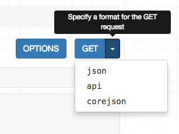

# Tutorial 7: Schemas & client libraries

A schema is a machine-readable document that describes the available API
endpoints, their URLS, and what operations they support.

Schemas can be a useful tool for auto-generated documentation, and can also
be used to drive dynamic client libraries that can interact with the API.

## Core API

In order to provide schema support REST framework uses [Core API][coreapi].

Core API is a document specification for describing APIs. It is used to provide
an internal representation format of the available endpoints and possible
interactions that an API exposes. It can either be used server-side, or
client-side.

When used server-side, Core API allows an API to support rendering to a wide
range of schema or hypermedia formats.

When used client-side, Core API allows for dynamically driven client libraries
that can interact with any API that exposes a supported schema or hypermedia
format.

## Adding a schema

REST framework supports either explicitly defined schema views, or
automatically generated schemas. Since we're using viewsets and routers,
we can simply use the automatic schema generation.

You'll need to install the `coreapi` python package in order to include an
API schema, and `pyyaml` to render the schema into the commonly used
YAML-based OpenAPI format.

    $ pip install coreapi pyyaml

We can now include a schema for our API, by including an autogenerated schema
view in our URL configuration.

```python
from rest_framework.schemas import get_schema_view

schema_view = get_schema_view(title='Pastebin API')

urlpatterns = [
    path('schema/', schema_view),
    ...
]
```

If you visit the `/schema/` endpoint in a browser you should now see `corejson`
representation become available as an option.



We can also request the schema from the command line, by specifying the desired
content type in the `Accept` header.

    $ http http://127.0.0.1:8000/schema/ Accept:application/coreapi+json
    HTTP/1.0 200 OK
    Allow: GET, HEAD, OPTIONS
    Content-Type: application/coreapi+json

    {
        "_meta": {
            "title": "Pastebin API"
        },
        "_type": "document",
        ...

The default output style is to use the [Core JSON][corejson] encoding.

Other schema formats, such as [Open API][openapi] (formerly Swagger) are
also supported.

## Using a command line client

Now that our API is exposing a schema endpoint, we can use a dynamic client
library to interact with the API. To demonstrate this, let's use the
Core API command line client.

The command line client is available as the `coreapi-cli` package:

    $ pip install coreapi-cli

Now check that it is available on the command line...

    $ coreapi
    Usage: coreapi [OPTIONS] COMMAND [ARGS]...

      Command line client for interacting with CoreAPI services.

      Visit https://www.coreapi.org/ for more information.

    Options:
      --version  Display the package version number.
      --help     Show this message and exit.

    Commands:
    ...

First we'll load the API schema using the command line client.

    $ coreapi get http://127.0.0.1:8000/schema/
    <Pastebin API "http://127.0.0.1:8000/schema/">
        snippets: {
            highlight(id)
            list()
            read(id)
        }
        users: {
            list()
            read(id)
        }

We haven't authenticated yet, so right now we're only able to see the read only
endpoints, in line with how we've set up the permissions on the API.

Let's try listing the existing snippets, using the command line client:

    $ coreapi action snippets list
    [
        {
            "url": "http://127.0.0.1:8000/snippets/1/",
            "id": 1,
            "highlight": "http://127.0.0.1:8000/snippets/1/highlight/",
            "owner": "lucy",
            "title": "Example",
            "code": "print('hello, world!')",
            "linenos": true,
            "language": "python",
            "style": "friendly"
        },
        ...

Some of the API endpoints require named parameters. For example, to get back
the highlight HTML for a particular snippet we need to provide an id.

    $ coreapi action snippets highlight --param id=1
    <!DOCTYPE html PUBLIC "-//W3C//DTD HTML 4.01//EN" "http://www.w3.org/TR/html4/strict.dtd">

    <html>
    <head>
      <title>Example</title>
      ...

## Authenticating our client

If we want to be able to create, edit and delete snippets, we'll need to
authenticate as a valid user. In this case we'll just use basic auth.

Make sure to replace the `<username>` and `<password>` below with your
actual username and password.

    $ coreapi credentials add 127.0.0.1 <username>:<password> --auth basic
    Added credentials
    127.0.0.1 "Basic <...>"

Now if we fetch the schema again, we should be able to see the full
set of available interactions.

    $ coreapi reload
    Pastebin API "http://127.0.0.1:8000/schema/">
        snippets: {
            create(code, [title], [linenos], [language], [style])
            delete(id)
            highlight(id)
            list()
            partial_update(id, [title], [code], [linenos], [language], [style])
            read(id)
            update(id, code, [title], [linenos], [language], [style])
        }
        users: {
            list()
            read(id)
        }

We're now able to interact with these endpoints. For example, to create a new
snippet:

    $ coreapi action snippets create --param title="Example" --param code="print('hello, world')"
    {
        "url": "http://127.0.0.1:8000/snippets/7/",
        "id": 7,
        "highlight": "http://127.0.0.1:8000/snippets/7/highlight/",
        "owner": "lucy",
        "title": "Example",
        "code": "print('hello, world')",
        "linenos": false,
        "language": "python",
        "style": "friendly"
    }

And to delete a snippet:

    $ coreapi action snippets delete --param id=7

As well as the command line client, developers can also interact with your
API using client libraries. The Python client library is the first of these
to be available, and a Javascript client library is planned to be released
soon.

For more details on customizing schema generation and using Core API
client libraries you'll need to refer to the full documentation.

## Reviewing our work

With an incredibly small amount of code, we've now got a complete pastebin Web API, which is fully web browsable, includes a schema-driven client library, and comes complete with authentication, per-object permissions, and multiple renderer formats.

We've walked through each step of the design process, and seen how if we need to customize anything we can gradually work our way down to simply using regular Django views.

You can review the final [tutorial code][repo] on GitHub, or try out a live example in [the sandbox][sandbox].

## Onwards and upwards

We've reached the end of our tutorial.  If you want to get more involved in the REST framework project, here are a few places you can start:

* Contribute on [GitHub][github] by reviewing and submitting issues, and making pull requests.
* Join the [REST framework discussion group][group], and help build the community.
* Follow [the author][twitter] on Twitter and say hi.

**Now go build awesome things.**

[coreapi]: https://www.coreapi.org/
[corejson]: https://www.coreapi.org/specification/encoding/#core-json-encoding
[openapi]: https://openapis.org/
[repo]: https://github.com/encode/rest-framework-tutorial
[sandbox]: https://restframework.herokuapp.com/
[github]: https://github.com/encode/django-rest-framework
[group]: https://groups.google.com/forum/?fromgroups#!forum/django-rest-framework
[twitter]: https://twitter.com/_tomchristie
